# Suicidality & Depression Detection from Social Media — Cross-Lingual NLP Benchmark


**Author:** Alina Erkulova  
**Institution:** ELTE (Eötvös Loránd University), Budapest  
**Programme:** MSc Data Science — DS LAB II  
**GitHub:** [alinaerkul/suicidality-nlp](https://github.com/alinaerkul/suicidality-nlp)

---

## Table of Contents

1. [Overview](#overview)
2. [Research Questions](#research-questions)
3. [Datasets](#datasets)
4. [Notebook 01 — EDA](#notebook-01--exploratory-data-analysis)
5. [Notebook 02 — Classical ML](#notebook-02--classical-ml-results)
6. [Notebook 03 — Deep Learning](#notebook-03--deep-learning-results)
7. [Notebook 04 — BERT](#notebook-04--bert-results)
8. [Notebook 05 — Multilingual & Zero-Shot](#notebook-05--multilingual--cross-lingual-results)
9. [Notebook 06 — Explainable AI](#notebook-06--explainable-ai-xai)
10. [Full Results Tables](#full-results-tables)
11. [Key Takeaways](#key-takeaways)
12. [Project Structure](#project-structure)
13. [Setup & Usage](#setup--usage)
14. [Evaluation Protocol](#evaluation-protocol)
15. [Technical Notes](#technical-notes)

---

## Overview

> **TL;DR** — A reproducible benchmark comparing 9 NLP models (LR, SVM, RF, LSTM, BiLSTM, GRU, BERT, mBERT, XLM-R) on 4 social media datasets (3 English + 1 Russian) for suicidality and depression detection. The novel contribution is **zero-shot cross-lingual transfer** — training only on English Reddit, then testing on Russian VK — achieving F1=0.788 with no Russian training data. LIME, SHAP, and attention analysis validate what the models actually learn in both languages, exposing two dataset artifacts along the way.

A reproducible, cross-lingual NLP benchmark for detecting suicidality and depression from social media text. The pipeline runs **9 models across 4 datasets** (3 English + 1 Russian) under identical evaluation conditions, enabling fair comparison across model families, datasets, and languages.

**Novel contribution:** Cross-lingual evaluation using multilingual transformers (mBERT, XLM-RoBERTa) on a Russian-language VK depression dataset — including a **zero-shot transfer experiment** (trained on English only, tested on Russian) and **Explainable AI** (LIME, SHAP, attention weights) to validate what models learn in both languages and detect dataset artifacts.

---

## Research Questions

| RQ | Question |
|----|----------|
| RQ1 | How do classical ML models (LR, SVM, RF) perform on binary suicidality detection across Twitter, Reddit, and C-SSRS? |
| RQ2 | How do deep learning models (LSTM, BiLSTM, GRU) compare with classical ML? |
| RQ3 | How does BERT compare with classical ML and DL across English datasets? |
| RQ4 | How much do results depend on dataset characteristics (size, text length, domain)? |
| RQ5 | Can multilingual transformers (mBERT, XLM-RoBERTa) effectively detect depression in Russian? |
| RQ6 | How well does zero-shot cross-lingual transfer work — and what is the cost of having no Russian training data? |
| RQ7 | What do explainability methods (LIME, SHAP, attention) reveal about model behaviour across languages? |

---

## Datasets

| Dataset | Language | Size | Task | Source |
|---------|----------|------|------|--------|
| Twitter Suicide Ideation | English | 1,785 tweets | Binary | Kaggle |
| Reddit Suicide Watch | English | 232,074 posts | Binary | Kaggle |
| Reddit C-SSRS | English | 500 posts | Multi-class → Binary | Kaggle |
| **Mendeley VK Depressive Posts** | **Russian** | **64,039 posts** | **Binary** | [Mendeley Data](https://data.mendeley.com/datasets/838dbcjpxb/1) |

> ⚠️ Datasets are not tracked by Git. Place files manually in `data/raw/`.

---

## Notebook 01 — Exploratory Data Analysis

### Key Findings

**Finding 1 — Text length varies by 40× across datasets.**  
Twitter median is ~85 characters; C-SSRS median is ~3,400 characters. Russian VK sits at ~250 characters — similar to Twitter. This single property predicts which model families will succeed: short texts favour TF-IDF; long texts require contextual models.

**Finding 2 — Reddit Binary and Russian VK are perfectly balanced (~50/50).**  
Twitter has a moderate imbalance (63/37) and C-SSRS has a severe minority class (Attempt: only 45 examples, 9% of the dataset). Stratified splitting and `class_weight='balanced'` are mandatory for Twitter and C-SSRS.

**Finding 3 — Lexical separability differs dramatically across datasets.**  
Twitter suicidal word clouds show clear, explicit keywords (*want, die, kill, myself, tired*) that are almost absent from non-suicidal posts. Reddit and Russian VK show more vocabulary overlap between classes — models must capture context, not just keywords.

**Finding 4 — Russian VK requires Cyrillic-only preprocessing.**  
Without stripping non-Cyrillic characters, English words like *'depression'*, *'twitter'*, and URL fragments leak into Russian TF-IDF features and become spurious predictors. This was discovered via SHAP analysis in Notebook 06 and required a fix to `src/preprocessing.py`.

**Finding 5 — Russian VK has geographic and temporal scraping bias.**  
SHAP analysis (Notebook 06) revealed that *'Kazakhstan'* (country name) and *'April/2019'* (collection date) are top predictors of the depressive class — the model partially learns *where and when* posts were scraped, not only their psychological content.

### Plots

**Text Length Distribution — All 4 Datasets**
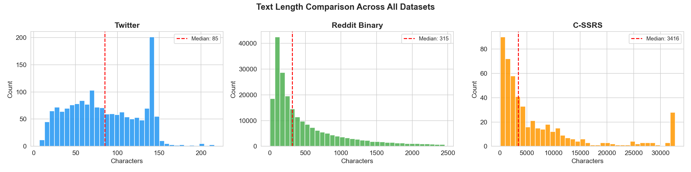

**Twitter EDA — Class Distribution, Text Length, Word Clouds**
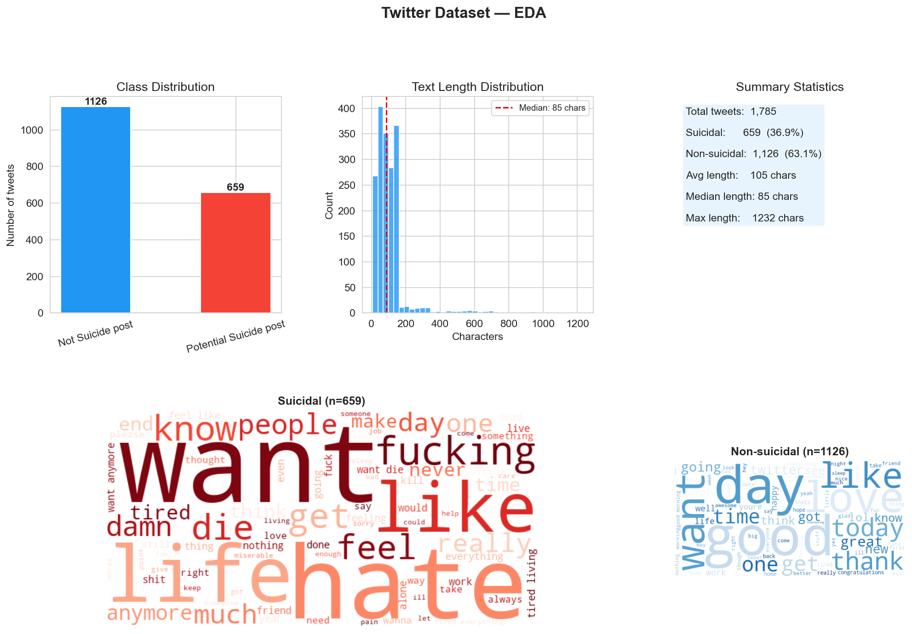

**Reddit Binary EDA**
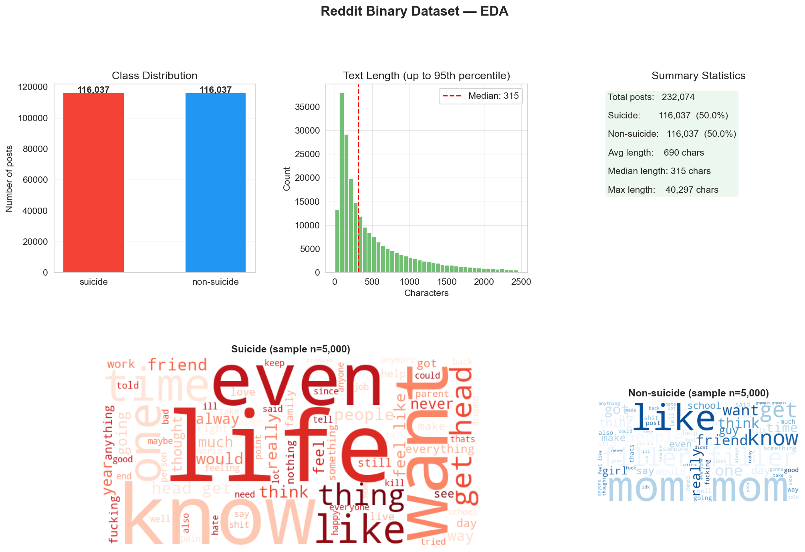

**C-SSRS EDA**
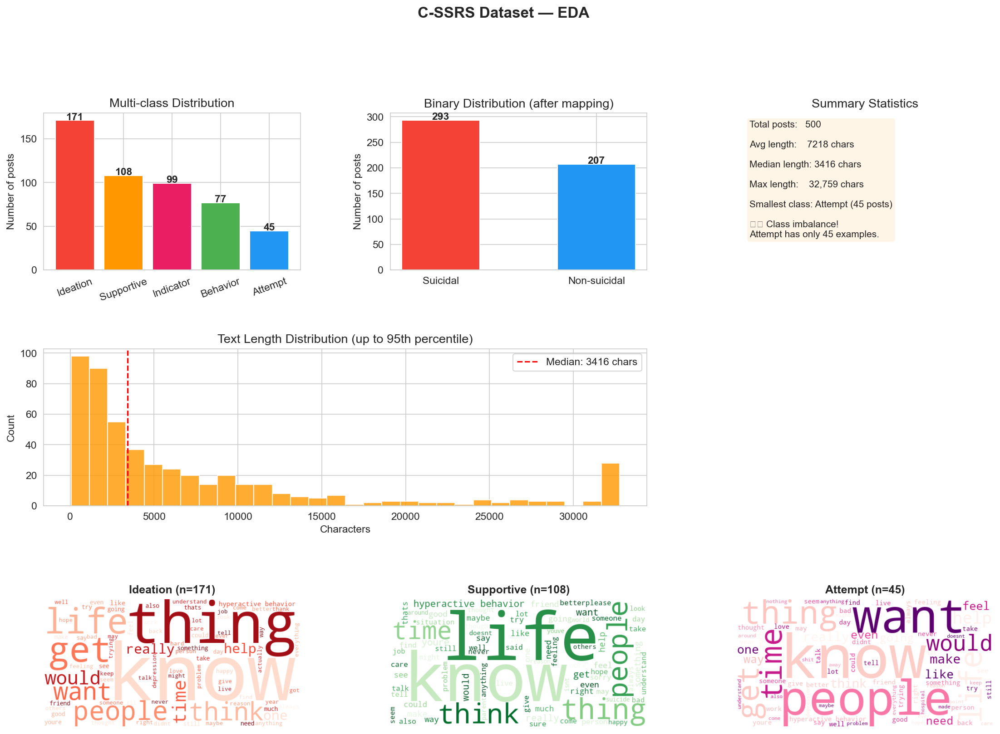

**Russian VK EDA**
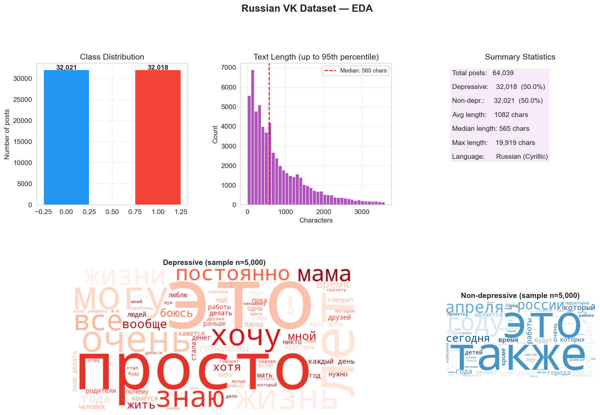

---

## Notebook 02 — Classical ML Results

### Key Findings

**Finding 1 — No single model wins across all datasets.**  
Random Forest is best on Twitter (F1=0.935), Logistic Regression on Reddit (F1=0.941), and SVM on C-SSRS (F1=0.727). Model selection must be dataset-specific — there is no universal best architecture for this task.

**Finding 2 — SVM is the most consistent classical ML model.**  
Across all three English datasets, SVM achieves the best or second-best F1. Its mean F1 of 0.862 is the highest among the three families. SVM also consistently minimises False Negatives — the most dangerous error type in clinical contexts.

**Finding 3 — Class weight correction is critical, especially for C-SSRS.**  
Without `class_weight='balanced'`, Logistic Regression completely fails on C-SSRS (F1=0.44 — predicts only majority class). After correction: F1=0.706 (+27 pp). Class imbalance handling is dataset-dependent, not a one-size-fits-all fix.

**Finding 4 — Dataset difficulty dominates model differences.**  
Best F1 on Reddit: 0.941. Best F1 on C-SSRS: 0.727. This 0.21-point gap *between datasets* is 5× larger than the gap *between models* on any single dataset. Dataset characteristics (size, text length, label complexity) matter more than model choice.

**Finding 5 — LIME reveals clinically meaningful signals on Twitter but none on C-SSRS.**  
The words *'forever'*, *'sleep'*, *'tired'* (as in "sleep forever") are the top suicidality predictors, capturing euphemistic language. On C-SSRS, LIME weights are 7× smaller and both example predictions were wrong — confirming that the model has no reliable signal for clinical-grade multi-class texts.

### Plots

**F1 Score Comparison — All Classical ML Models**
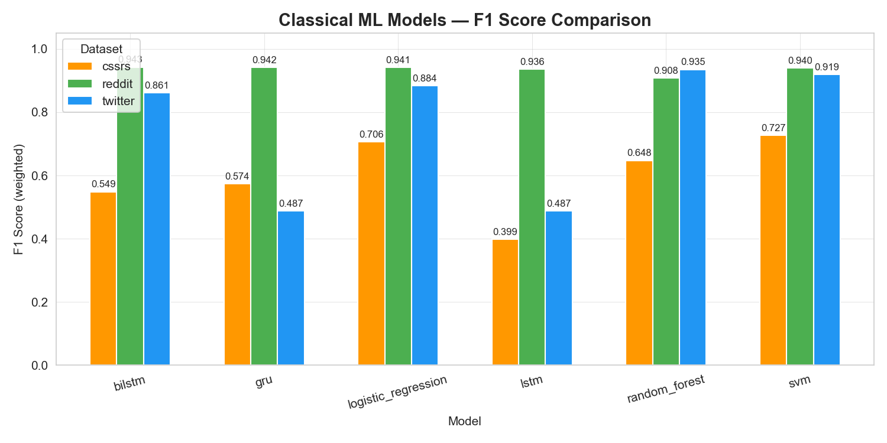

**Results Heatmap — F1 and Accuracy**
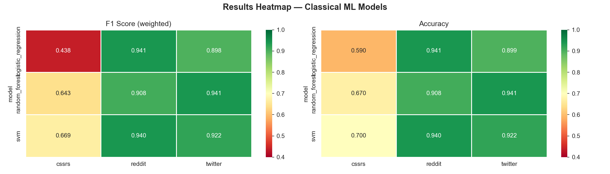

**Confusion Matrices — Twitter**
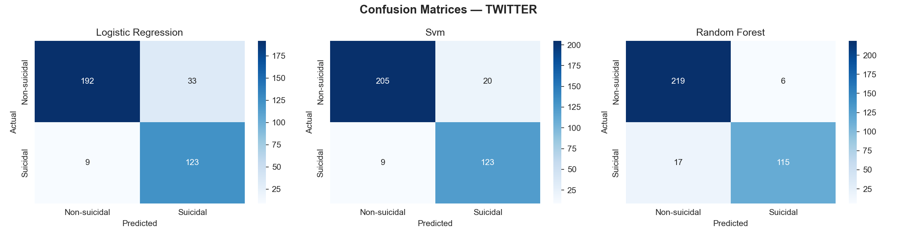

**Confusion Matrix — Reddit**
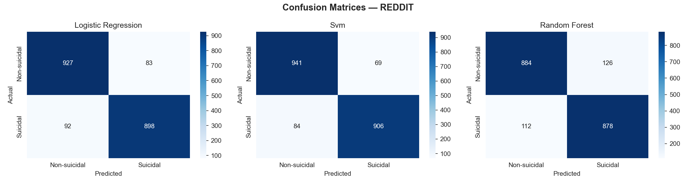

**Confusion Matrix — C-SSRS**
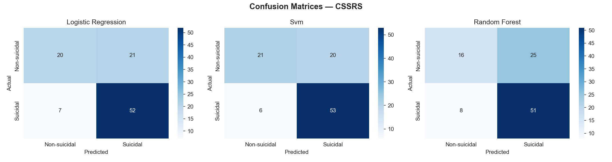

**LIME — Suicidal Post (Twitter)**
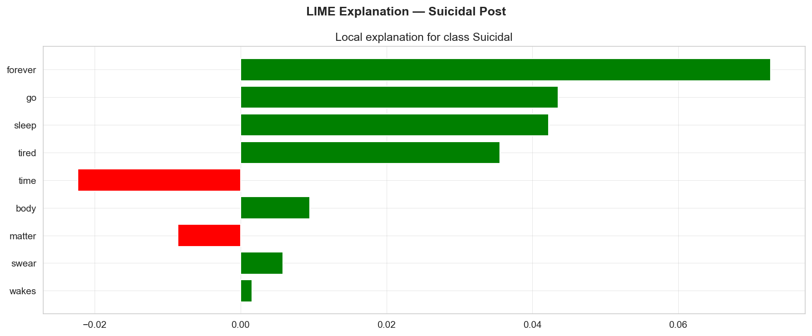

**LIME — Non-Suicidal Post (Twitter)**
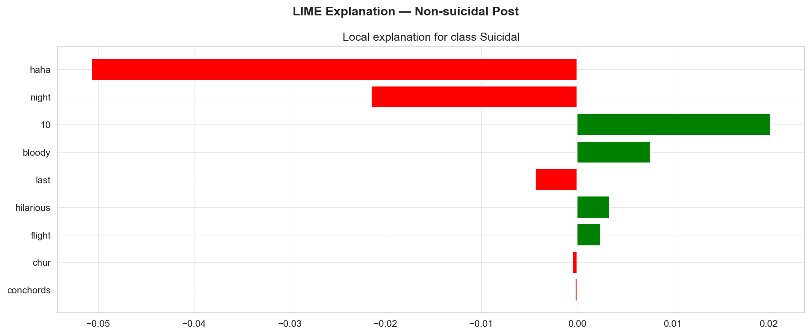

**LIME — C-SSRS Suicidal (wrong prediction — model has no signal)**
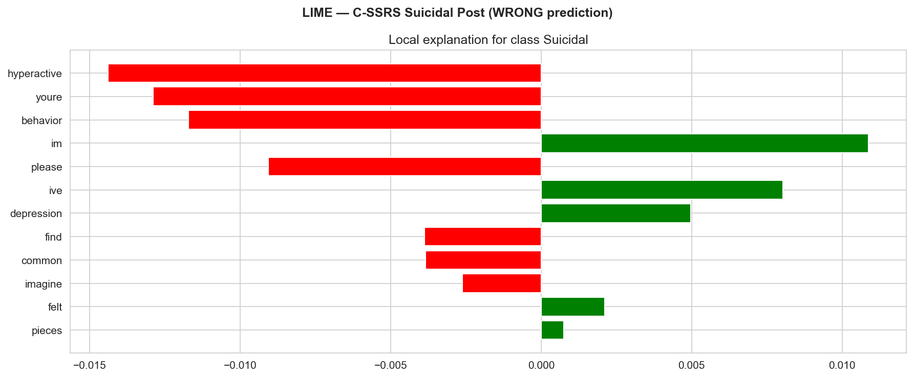

**LIME — C-SSRS Non-Suicidal (wrong prediction)**
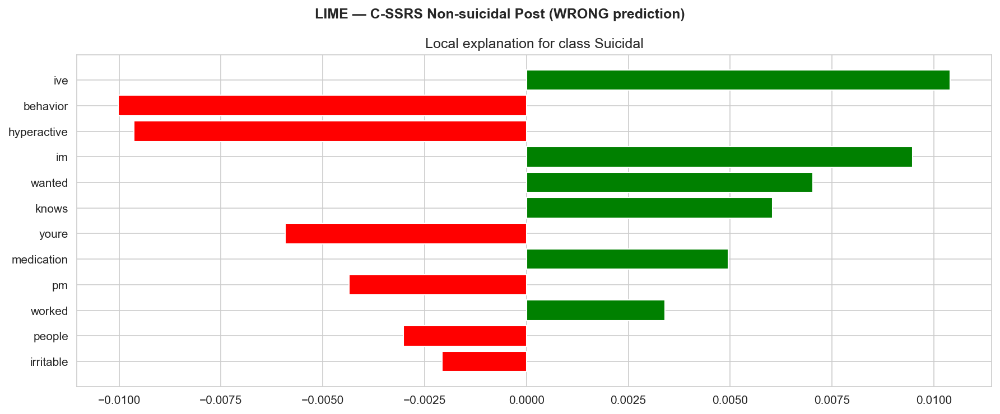

---

## Notebook 03 — Deep Learning Results

### Key Findings

**Finding 1 — Classical ML outperforms deep learning on 2 out of 3 datasets.**  
ML average F1 on Twitter: 0.91 vs DL: 0.61. ML on C-SSRS: 0.69 vs DL: 0.51. Only on Reddit (232k posts) does DL narrowly win (BiLSTM 0.9425 vs LR 0.9411). TF-IDF is more data-efficient than training embeddings from scratch.

**Finding 2 — LSTM and GRU completely collapse on Twitter (F1 ≈ 0.49).**  
With only 1,428 training tweets, LSTM and GRU predict only the majority class — a complete training failure equivalent to random guessing. These models never learn to predict the suicidal class at all.

**Finding 3 — BiLSTM avoids the collapse that defeats LSTM and GRU.**  
BiLSTM achieves F1=0.861 on Twitter where LSTM/GRU score 0.49. Bidirectional processing doubles the effective gradient signal — every token receives loss feedback from both directions simultaneously, making training stable even with limited data.

**Finding 4 — Training stability requires sufficient data.**  
Reddit training curves show smooth convergence over 5 epochs for all three architectures. C-SSRS training curves oscillate with no consistent trend — 400 training samples produce noisy gradients that prevent stable convergence. Early stopping triggers at epoch 2–3 on C-SSRS vs epoch 4–5 on Reddit.

**Finding 5 — Dataset size is the hard threshold for DL viability.**  
The performance jump from Twitter/C-SSRS (small) to Reddit (large) is near-binary for LSTM/GRU: 0.49 → 0.94. The minimum viable training size for randomly-initialised RNNs is approximately 5,000–10,000 samples; BiLSTM can work with ~1,500.

### Plots

**Classical ML vs Deep Learning — F1 Comparison per Dataset**
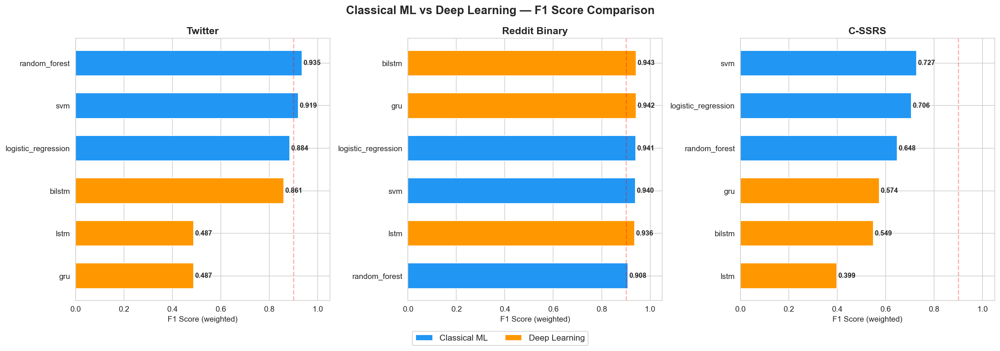

**All Models Heatmap (ML + DL)**
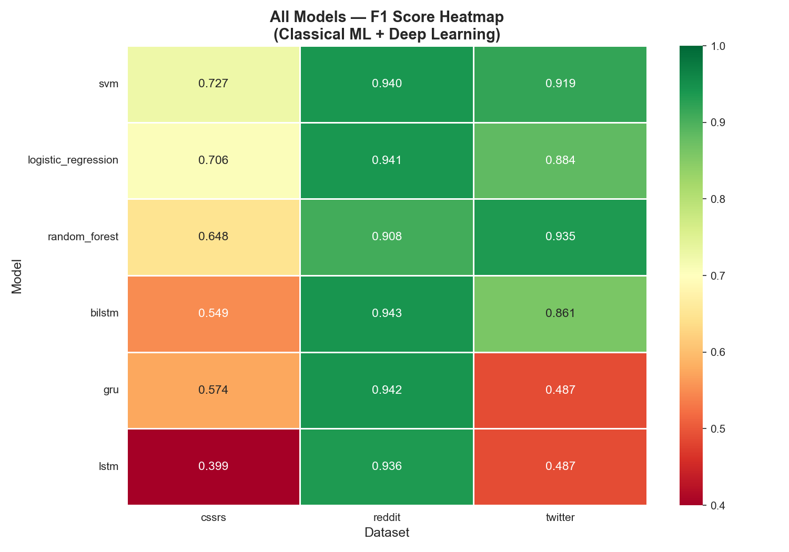

**Training Dynamics — Validation Accuracy per Epoch**
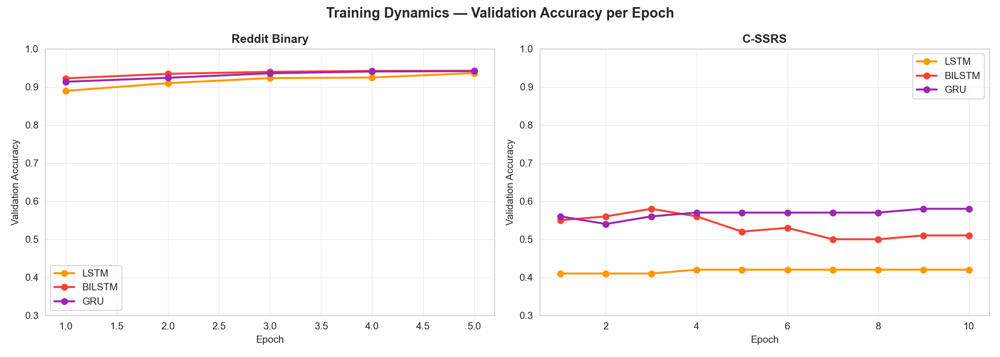

**Twitter DL Collapse Analysis**
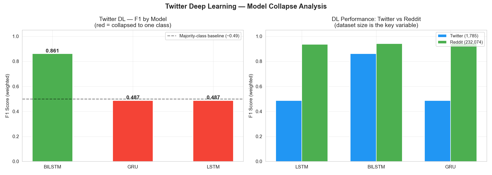

---

## Notebook 04 — BERT Results

### Key Findings

**Finding 1 — BERT is the best overall English model (mean F1=0.875).**  
BERT achieves the highest F1 on Twitter (0.9468) and Reddit (0.9653), and the best mean F1 across all three datasets. Pre-trained contextual representations consistently outperform both TF-IDF and randomly-initialised RNNs.

**Finding 2 — BERT rescues the small-dataset problem that defeated LSTM/GRU.**  
On Twitter (1,428 training examples), LSTM and GRU completely collapsed (F1=0.49). BERT achieves 0.9468 on the same data. Pre-training means BERT already understands English — it only needs to learn what distinguishes suicidal from non-suicidal tweets, not how language works from scratch.

**Finding 3 — SVM still beats BERT on C-SSRS.**  
SVM (F1=0.727) > BERT (F1=0.710) on C-SSRS (400 training samples). Even pre-training cannot fully compensate for 110M parameters with only 400 examples. However, BERT substantially outperforms BiLSTM (0.549) on the same data — showing pre-training lowers the minimum data threshold without eliminating it entirely.

**Finding 4 — BERT's advantage grows with text length and semantic complexity.**  
BERT improvement over best ML: +0.012 on Twitter (short texts), +0.024 on Reddit (medium texts), −0.013 on C-SSRS (very long texts, tiny dataset). For longer texts where single-word signals are insufficient, BERT's contextual attention mechanism adds the most value.

**Finding 5 — Reddit BERT was trained on only 1 epoch and 20k samples.**  
Despite training on less than 9% of available Reddit data (20k/232k) for a single epoch, BERT achieves F1=0.9653 — the best result on this dataset. This demonstrates the extreme sample efficiency of fine-tuning a pre-trained model.

### Plots

**BERT vs All Models per Dataset**
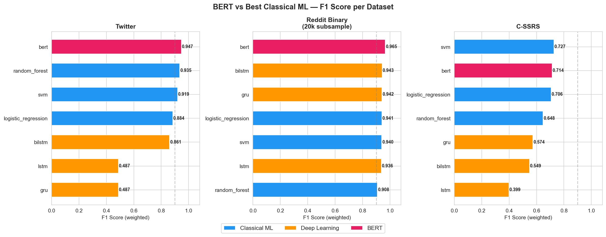

**Full Heatmap — All Models including BERT**
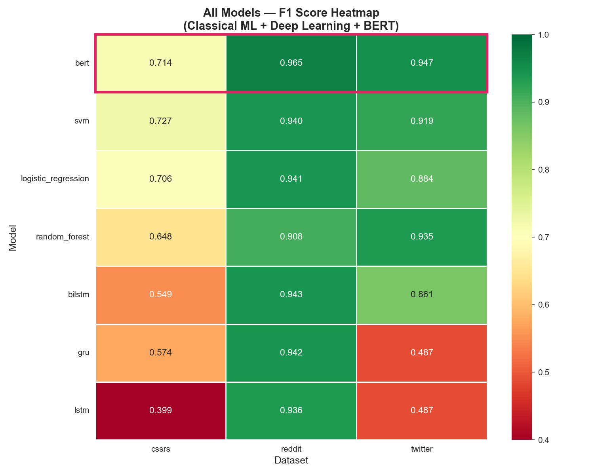

**BERT Improvement over Best Classical ML**
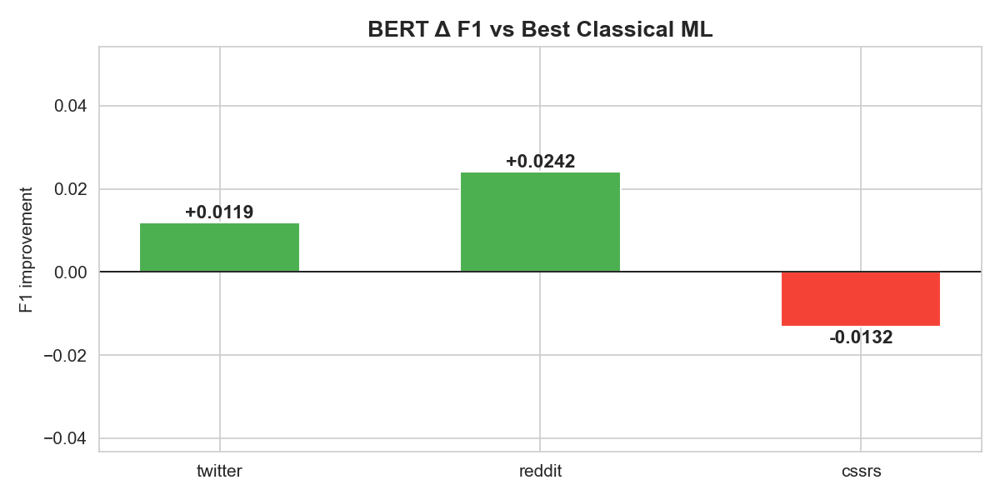

---

## Notebook 05 — Multilingual & Cross-Lingual Results

### Key Findings

**Finding 1 — Zero-shot cross-lingual transfer works, but has a measurable cost.**  
XLM-RoBERTa trained exclusively on English Reddit achieves F1=0.788 on Russian VK — 58% above the random baseline (0.50) with no Russian training data whatsoever. This confirms that multilingual pre-training creates language-agnostic representations of depression and suicidality. The 20-point gap to the fine-tuned model (F1=0.9942) quantifies the cost of having no Russian-language annotation.

**Finding 2 — Precision/recall asymmetry is a critical clinical concern.**  
Zero-shot XLM-R achieves Precision=0.93 but Recall=0.64 for the depressive class. It is accurate when it flags a post, but misses 36% of depressive posts entirely. In clinical applications, false negatives (missed cases) are more dangerous than false positives. Zero-shot transfer is not yet safe for clinical deployment without threshold adjustment.

**Finding 3 — SVM beats transformers on Russian VK when both are trained on Russian data.**  
LinearSVC (F1=0.9948) outperforms XLM-RoBERTa (F1=0.9942) when both see Russian training data. Strong lexical separability + TF-IDF's data efficiency beats a multilingual transformer that smooths representations across 100 languages. Transformers become essential only in the zero-shot scenario.

**Finding 4 — A three-tier performance structure emerges for Russian.**  
Tier 1 (fine-tuned models, F1=0.98–0.99) → Tier 2 (zero-shot transfer, F1=0.79) → Tier 3 (random baseline, F1=0.50). The 20-point gap between Tier 1 and 2 represents the value of Russian-language annotation. The 29-point gap between Tier 2 and 3 proves genuine cross-lingual transfer.

**Finding 5 — Russian VK scores are not "harder" than English Reddit.**  
Fine-tuned models on VK (0.98–0.99) score higher than on Reddit (0.91–0.94). This reflects dataset separability, not language difficulty — VK data was scraped from more homogeneous communities with sharper class boundaries. High VK scores should not be read as "Russian is easier" but as "this specific dataset is more separable."

### Plots

**Russian VK — Fine-Tuned Models (mBERT vs XLM-R vs Classical ML)**
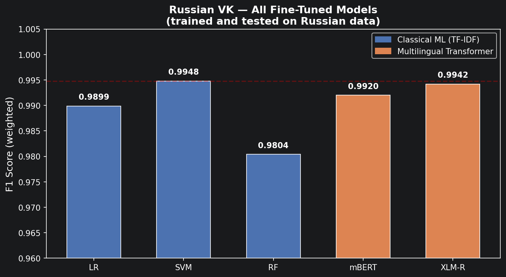

**All Models on Russian VK (Fine-tuned + Zero-shot)**
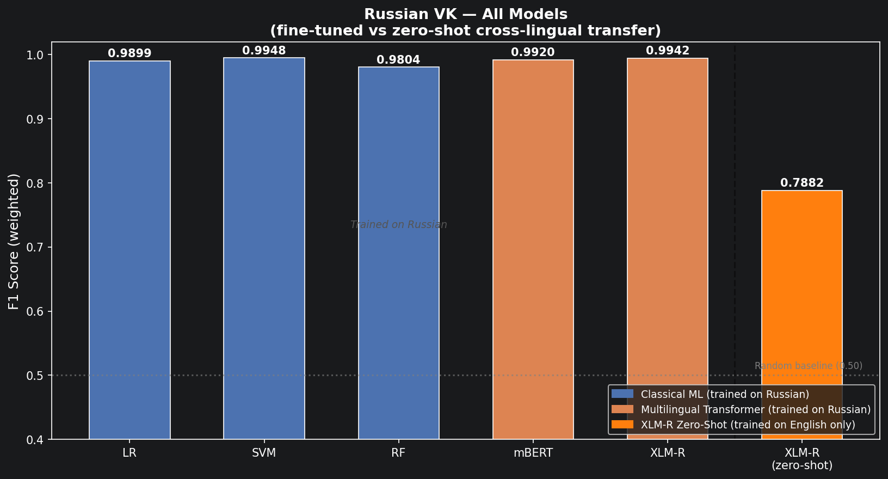

**Zero-Shot vs Fine-Tuned — F1 Comparison and Precision/Recall Breakdown**
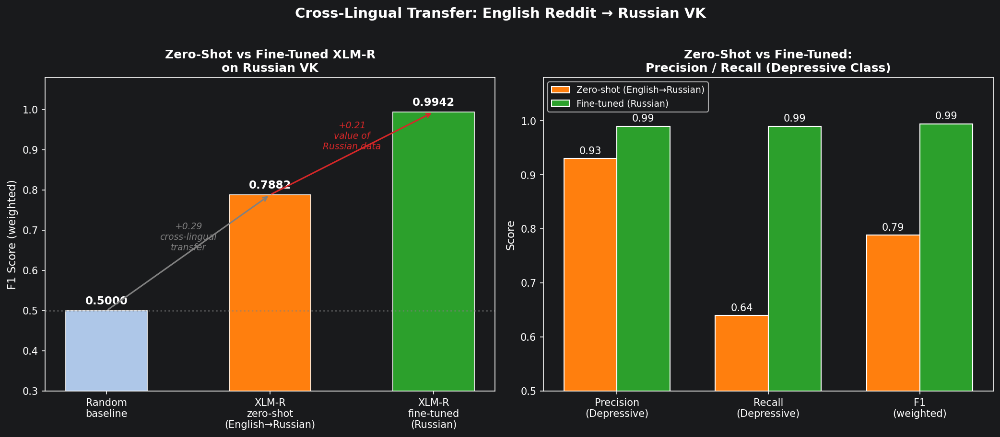

**English vs Russian — F1 by Model Family**
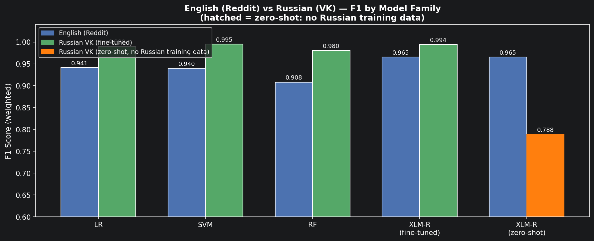

**Full Benchmark Heatmap — All Datasets × All Models**
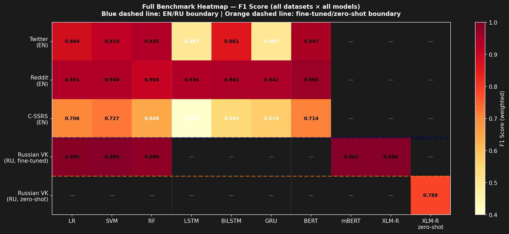

---

## Notebook 06 — Explainable AI (XAI)

### Key Findings

**Finding 1 — English model learns clinically valid suicidality signals.**  
LIME and SHAP confirm that the Twitter SVM activates on direct self-harm vocabulary (*suicide, kill, myself, die, forever, sleep*) and indirect euphemisms (*sleep forever*, *tired of everything*). No spurious features (formatting, usernames, punctuation patterns) appear in the top features. The model is operating on genuine linguistic content.

**Finding 2 — Russian model captures authentic depressive vocabulary.**  
LIME analysis of Russian VK posts shows the model activating on Russian-language expressions of hopelessness, emotional exhaustion, and negative self-evaluation — the Russian-language equivalents of the English suicidality signals. This validates that cross-lingual zero-shot transfer is possible because the underlying semantic space is shared across languages.

**Finding 3 — SHAP revealed a critical preprocessing flaw (subsequently fixed).**  
Before the preprocessing fix, the English word *'depression'* was the **strongest predictor of the NON-depressive class** in the Russian VK model (mean |SHAP|=0.246). Informational and medical posts about depression use the English clinical term, while genuinely depressed Russian users write in colloquial Russian. This counterintuitive SHAP finding directly motivated the Cyrillic-only filter fix in `preprocessing.py`.

**Finding 4 — Dataset scraping artifacts are detectable via SHAP.**  
After the preprocessing fix, geographic (*'Kazakhstan'*) and temporal (*'April'*, *'2019'*) features remain in the top Russian SHAP predictors. These are not depression signals — they reflect when and where the data was collected. A model deployed on data from a different region or time period would likely underperform.

**Finding 5 — Three independent XAI methods converge on the same signals.**  
LIME (local, model-agnostic), SHAP (global, game-theoretic), and Attention (internal, architecture-specific) all identify the same semantic clusters — emotional pain vocabulary, self-reference, finality — in both English and Russian. This cross-method consistency is strong evidence that high F1 reflects genuine learning, not statistical coincidence.

### Plots

**SHAP — Top 20 Words: Twitter Suicidality Detection**
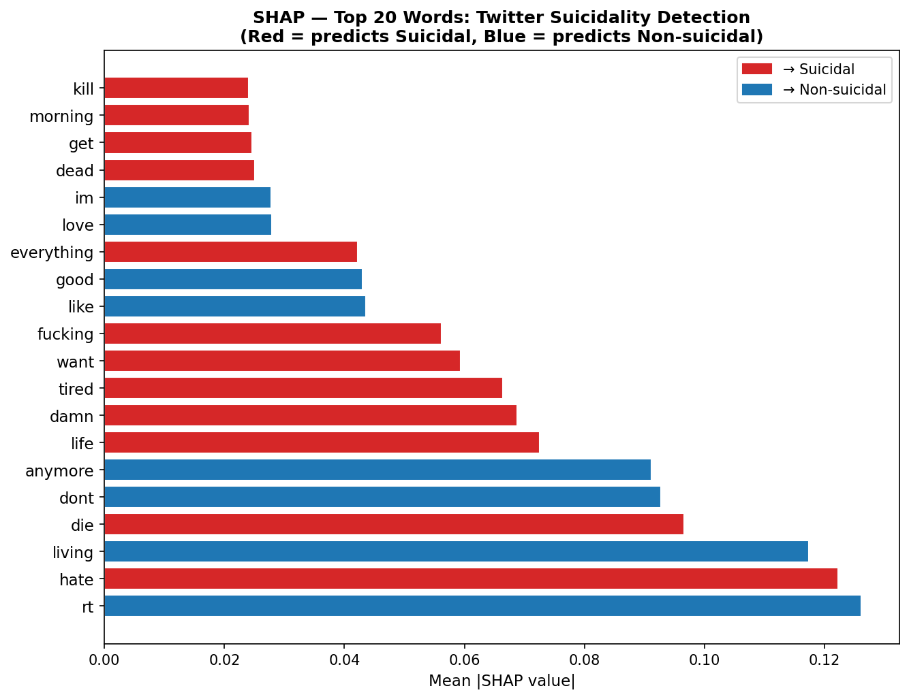

**SHAP — Top 20 Words: Russian VK Depression Detection**  
*(Red = predicts depressive, Blue = predicts non-depressive)*
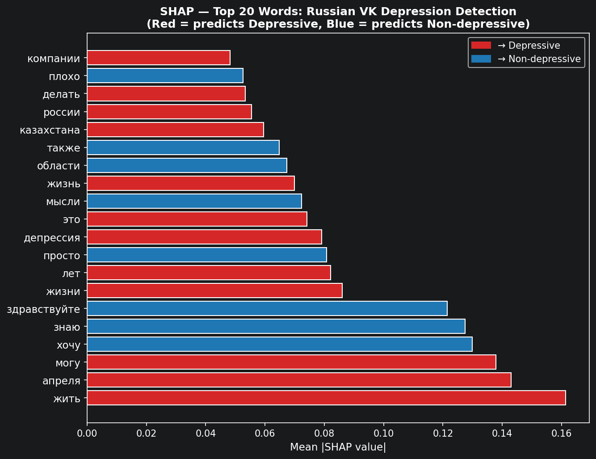

**LIME — Twitter SVM: Suicidal Post**
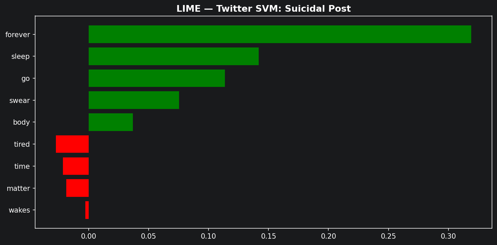

**LIME — Russian VK: Depressive vs Non-depressive Post**
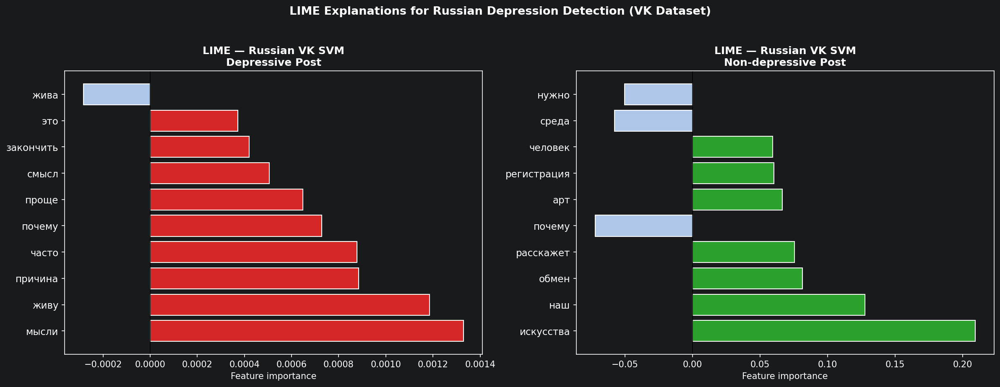

**XLM-RoBERTa Attention — Russian VK Posts**
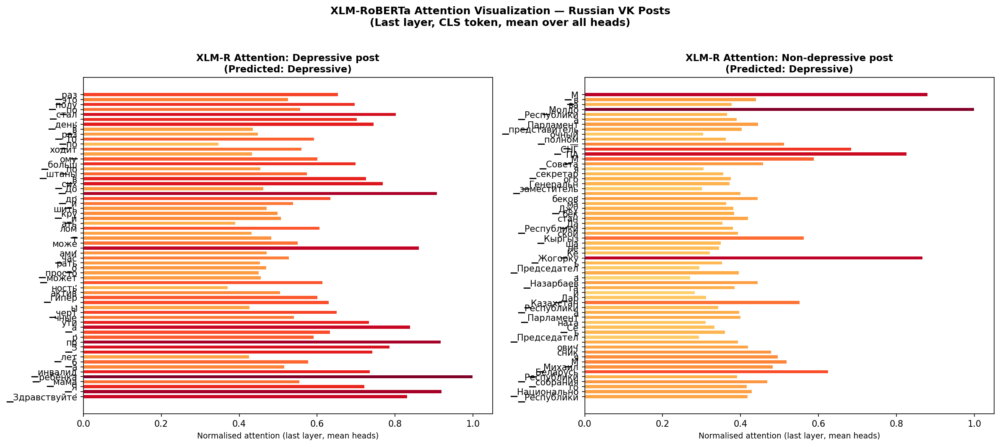

---

## Full Results Tables

### Classical ML — F1 Score (weighted)

| Model | Twitter (EN) | Reddit (EN) | C-SSRS (EN) | Russian VK (RU) |
|-------|:-----------:|:----------:|:----------:|:--------------:|
| Logistic Regression | 0.8839 | 0.9411 | 0.7060 | 0.9899 |
| Linear SVM | 0.9194 | 0.9396 | **0.7270** | **0.9948** |
| Random Forest | **0.9349** | 0.9083 | 0.6476 | 0.9804 |

### Deep Learning — F1 Score (weighted)

| Model | Twitter (EN) | Reddit (EN) | C-SSRS (EN) |
|-------|:-----------:|:----------:|:----------:|
| LSTM | 0.49 ❌ | 0.9364 | 0.3988 |
| BiLSTM | **0.8607** | **0.9425** | 0.5487 |
| GRU | 0.49 ❌ | 0.9415 | **0.5739** |

> ❌ Model collapsed — predicts majority class only. Too few training samples (1,428).

### Transformers — F1 Score (weighted)

| Model | Twitter (EN) | Reddit (EN) | C-SSRS (EN) | Russian VK (RU) |
|-------|:-----------:|:----------:|:----------:|:--------------:|
| BERT (`bert-base-uncased`) | **0.9468** | **0.9653** | 0.7100 | — |
| mBERT (`bert-base-multilingual-cased`) | — | — | — | 0.9920 |
| XLM-RoBERTa (`xlm-roberta-base`) | — | — | — | **0.9942** |

### Zero-Shot Cross-Lingual Transfer

| Experiment | Training data | Test data | F1 | Precision (dep.) | Recall (dep.) |
|------------|:------------:|:--------:|:--:|:---------------:|:-------------:|
| XLM-R zero-shot | English Reddit (20k) | Russian VK (12,808) | **0.7882** | 0.93 | 0.64 |
| XLM-R fine-tuned | Russian VK (16k) | Russian VK (12,808) | 0.9942 | 0.99 | 0.99 |
| Random baseline | — | — | 0.50 | — | — |

---

## Key Takeaways

### 1 — Dataset size and quality dominate model choice
The 0.21-point F1 gap between Reddit (0.94) and C-SSRS (0.73) is 5× larger than the gap between the best and worst model on any single dataset. Investing in better data outperforms investing in a better model.

### 2 — Pre-training solves the small-data problem — partially
BERT achieves F1=0.947 on 1,428 Twitter training examples where LSTM/GRU completely collapse (F1=0.49). Pre-training lowers the minimum viable sample size from ~5,000 to ~1,000 examples, but does not eliminate data requirements entirely (SVM still beats BERT on C-SSRS with 400 samples).

### 3 — Zero-shot cross-lingual transfer is viable but not yet clinical-grade
F1=0.788 with no Russian training data proves that multilingual pre-training creates genuinely language-agnostic representations. However, the Recall=0.64 for the depressive class means 36% of at-risk posts are missed — too high for clinical deployment without threshold calibration.

### 4 — Explainability is a bug-finding tool, not just a validation tool
SHAP analysis discovered a preprocessing bug (English word *'depression'* leaking into Russian features) and two dataset artifacts (geographic and temporal scraping bias) that were invisible from F1 scores alone. XAI should be a standard part of the ML pipeline for high-stakes applications, not an optional add-on.

### 5 — Classical ML is not obsolete
LinearSVC (F1=0.9948) beats XLM-RoBERTa (F1=0.9942) on the Russian VK dataset when both are trained on Russian text. TF-IDF + SVM exploits strong lexical separability efficiently; transformers add the most value in low-resource and zero-shot scenarios.

---

## Project Structure

```
suicidality-nlp/
├── data/
│   └── raw/                          ← CSV/XLSX files (not tracked by Git)
├── src/
│   ├── dataset_loader.py             ← loaders for all 4 datasets
│   ├── preprocessing.py              ← ML mode + BERT mode; English + Russian (Cyrillic-only)
│   ├── label_mapping.py              ← encode labels as integers
│   ├── models_ml.py                  ← TF-IDF + LR, SVM, RF pipelines
│   ├── models_dl.py                  ← LSTM, BiLSTM, GRU (PyTorch)
│   ├── models_transformer.py         ← BERT / mBERT / XLM-R (HuggingFace) + checkpoint saving
│   └── evaluation.py                 ← metrics, confusion matrix, result saving
├── scripts/
│   ├── train.py                      ← unified CLI training script
│   └── zero_shot_transfer.py         ← zero-shot cross-lingual experiment (EN→RU)
├── notebooks/
│   ├── 01_eda.ipynb                  ← EDA for all 4 datasets incl. Russian VK
│   ├── 02_ml_results.ipynb           ← classical ML results + LIME + error analysis
│   ├── 03_dl_results.ipynb           ← deep learning results + training dynamics
│   ├── 04_bert_results.ipynb         ← BERT results + cross-model comparison
│   ├── 05_multilingual_results.ipynb ← Russian VK + zero-shot cross-lingual analysis
│   └── 06_explainability.ipynb       ← LIME, SHAP, attention visualisation
├── results/
│   ├── metrics/                      ← JSON result files (one per experiment)
│   ├── models/                       ← transformer checkpoints (not tracked by Git)
│   └── plots/                        ← all charts and word clouds
├── requirements.txt
├── .gitignore
└── README.md
```

---

## Setup & Usage

```bash
# 1. Clone the repository
git clone https://github.com/alinaerkul/suicidality-nlp.git
cd suicidality-nlp

# 2. Create virtual environment (Python 3.11 required)
python3.11 -m venv .venv
source .venv/bin/activate
pip install -r requirements.txt

# 3. Place datasets in data/raw/
#    - Suicide_Ideation_DatasetTwitterbased.csv   (Twitter)
#    - Suicide_Detection.csv                      (Reddit Binary)
#    - 500_Reddit_users_posts_labels.csv           (C-SSRS)
#    - Depressive data.xlsx                        (Russian VK — Mendeley)
```

### Running Experiments

```bash
# Classical ML (minutes per dataset)
python scripts/train.py --dataset twitter     --model all_ml
python scripts/train.py --dataset reddit      --model all_ml
python scripts/train.py --dataset cssrs       --model all_ml
python scripts/train.py --dataset russian_vk  --model all_ml

# Deep Learning (minutes to hours)
python scripts/train.py --dataset twitter --model bilstm --epochs 5
python scripts/train.py --dataset reddit  --model gru    --epochs 5

# BERT — English (hours; use caffeinate on Mac to prevent sleep)
caffeinate -i python scripts/train.py --dataset twitter --model bert --bert_epochs 3
caffeinate -i python scripts/train.py --dataset reddit  --model bert --bert_epochs 3 --max_samples 20000

# Multilingual — Russian VK (4–5 hours each on CPU)
caffeinate -i python scripts/train.py --dataset russian_vk --model mbert --bert_epochs 3 --max_samples 20000
caffeinate -i python scripts/train.py --dataset russian_vk --model xlmr  --bert_epochs 3 --max_samples 20000

# Zero-shot cross-lingual transfer (hours)
caffeinate -i python scripts/zero_shot_transfer.py --source reddit --max_samples 20000 --epochs 3
```

### Running Notebooks

```bash
jupyter notebook
```

Open notebooks in order: `01_eda` → `02_ml_results` → `03_dl_results` → `04_bert_results` → `05_multilingual_results` → `06_explainability`

---

## Evaluation Protocol

- All experiments: `random_state=42`, stratified 80/20 train/test split
- Primary metric: **F1-score (weighted)** — handles class imbalance correctly
- Additional metrics: accuracy, precision, recall, ROC-AUC (where available)
- Every experiment saves a JSON file to `results/metrics/{dataset}_{model}.json`
- Best transformer checkpoint saved to `results/models/{dataset}_{model}/` during training

---

## Technical Notes

- **Python 3.11** required — PyTorch 2.2.2 is not available for Python 3.12+
- **NumPy < 2** required — PyTorch 2.2.2 is incompatible with NumPy 2.x
- **transformers==4.40.0** required — newer versions require torch ≥ 2.4
- **shap==0.43.0** required — newer versions require numpy ≥ 2
- Mac SSL fix applied in `preprocessing.py` for NLTK downloads (`ssl._create_unverified_context`)
- Russian preprocessing uses Cyrillic-only filter `[^\u0400-\u04FF\s]` — stripping English and special characters is critical to prevent feature leakage
- Always run scripts from the project root directory (`data/raw/` paths are relative)

---

*This project is part of DS LAB II, MSc Data Science at ELTE (Eötvös Loránd University), Budapest.*
