# Suicidality & Depression Detection from Social Media — Cross-Lingual NLP Benchmark


**Author:** Alina Erkulova  
**Institution:** ELTE (Eötvös Loránd University), Budapest  
**Programme:** MSc Data Science — DS LAB II  
**GitHub:** [alinaerkul/suicidality-nlp](https://github.com/alinaerkul/suicidality-nlp)

---

## Table of Contents

1. [Overview](#overview)
2. [Research Questions](#research-questions)
3. [Datasets](#datasets)
4. [Related Work](#related-work)
5. [Notebook 01 — EDA](#notebook-01--exploratory-data-analysis)
6. [Notebook 02 — Classical ML](#notebook-02--classical-ml-results)
7. [Notebook 03 — Deep Learning](#notebook-03--deep-learning-results)
8. [Notebook 04 — BERT](#notebook-04--bert-results)
9. [Notebook 05 — Multilingual & Zero-Shot](#notebook-05--multilingual--cross-lingual-results)
10. [Notebook 06 — Explainable AI](#notebook-06--explainable-ai-xai)
11. [Full Results Tables](#full-results-tables)
12. [Comparison with Prior Work](#comparison-with-prior-work)
13. [Key Takeaways](#key-takeaways)
14. [Project Structure](#project-structure)
15. [Setup & Usage](#setup--usage)
16. [Evaluation Protocol](#evaluation-protocol)
17. [Technical Notes](#technical-notes)

---

## Overview

> **TL;DR** — A reproducible benchmark comparing 9 NLP models (LR, SVM, RF, LSTM, BiLSTM, GRU, BERT, mBERT, XLM-R) on 4 social media datasets (3 English + 1 Russian) for suicidality and depression detection. The novel contribution is **zero-shot cross-lingual transfer** — training only on English Reddit, then testing on Russian VK — with mBERT achieving F1=0.877 and XLM-R achieving F1=0.788 with no Russian training data. A few-shot learning curve shows that just 100 Russian examples close 84% of the zero-shot performance gap. LIME, SHAP, and attention analysis validate what the models actually learn in both languages, exposing two dataset artifacts along the way.

A reproducible, cross-lingual NLP benchmark for detecting suicidality and depression from social media text. The pipeline runs **9 models across 4 datasets** (3 English + 1 Russian) under identical evaluation conditions, enabling fair comparison across model families, datasets, and languages.

**Novel contribution:** Cross-lingual evaluation using multilingual transformers (mBERT, XLM-RoBERTa) on a Russian-language VK depression dataset — including a **zero-shot transfer experiment** (trained on English only, tested on Russian) and **Explainable AI** (LIME, SHAP, attention weights) to validate what models learn in both languages and detect dataset artifacts.

---

## Research Questions

| RQ | Question |
|----|----------|
| RQ1 | How do classical ML models (LR, SVM, RF) perform on binary suicidality detection across Twitter, Reddit, and C-SSRS? |
| RQ2 | How do deep learning models (LSTM, BiLSTM, GRU) compare with classical ML? |
| RQ3 | How does BERT compare with classical ML and DL across English datasets? |
| RQ4 | How much do results depend on dataset characteristics (size, text length, domain)? |
| RQ5 | Can multilingual transformers (mBERT, XLM-RoBERTa) effectively detect depression in Russian? |
| RQ6 | How well does zero-shot cross-lingual transfer work — and what is the cost of having no Russian training data? |
| RQ7 | What do explainability methods (LIME, SHAP, attention) reveal about model behaviour across languages? |

---

## Datasets

| Dataset | Language | Size | Task | Source |
|---------|----------|------|------|--------|
| Twitter Suicide Ideation | English | 1,785 tweets | Binary | Kaggle |
| Reddit Suicide Watch | English | 232,074 posts | Binary | Kaggle |
| Reddit C-SSRS | English | 500 posts | Multi-class → Binary | Kaggle |
| **Mendeley VK Depressive Posts** | **Russian** | **64,039 posts** | **Binary** | [Mendeley Data](https://data.mendeley.com/datasets/838dbcjpxb/1) |

> Datasets are not tracked by Git. Place files manually in `data/raw/`.

---

## Related Work

The table below lists the papers most closely related to this project — either as **dataset sources** (must-cite) or as **methodological comparisons**. All numbers are verified against primary sources.

| Paper | Venue | Relation to this project | Dataset | Best reported result |
|---|---|---|---|---|
| Narynov et al. (2020) | Data in Brief | **Russian VK dataset source** — must cite | VK 64k posts | No F1 reported (data paper) |
| Gaur et al. (2019) | WWW 2019 | **C-SSRS dataset source** — must cite | C-SSRS 500 users | CNN > SVM (+4.2% recall, 5-class) |
| Gaur et al. (2021) | PLOS ONE | Temporal C-SSRS analysis | C-SSRS 448 users | AUC 0.78 (LSTM+CNN, 5-class) |
| Ji et al. (2022) | LREC 2022 | MentalBERT — domain-adapted BERT | UMD Reddit / Twitter | F1 58.26 suicide / F1 89.01 Twitter |
| Yang et al. (2024) | WWW 2024 | MentaLLaMA — LLMs vs fine-tuned (10 datasets) | Reddit / Twitter multi-task | MentalRoBERTa F1 95.11 (Depression_Reddit) |
| Haque et al. (2021) | ECML 2021 | Label noise in Reddit subreddit labels | Reddit 1.9k | F1 73.61 (GUSE+Dense) |
| Yeskuatov et al. (2022) | IJERPH | Review: 21 models on Reddit datasets | Multiple Reddit | XGBoost F1 0.957 (7k binary) |
| **Raihan et al. (2025)** ⭐ | arXiv 2025 | **LLMs on same Russian VK dataset** | **VK 32k (Narynov)** | **GPT-4 F1 0.87 (zero-shot CoT)** |
| Aguirre et al. (2024) | COLING 2025 | Multilingual model (6 European languages) | Spanish tweets (translated) | mT5 F1 88.1 (with train data in all languages) |
| Bucur et al. (2025) | arXiv 2025 | Survey: 108 multilingual mental health datasets | 24 languages | — (survey) |
| Nguyen & Pham (2024) | arXiv 2024 | LLM ensemble, limited labels | Reddit 4-class (500) | Ensemble F1 0.811 |
| Pokrywka et al. (2024) | arXiv 2024 | DeBERTa/GPT-4 multiclass suicide | Reddit 4-class (500) | GPT-4o fine-tuned wF1 74.8 |

**Key differentiators of this project vs. all listed papers:**
- Only project providing both fine-tuned transformer benchmarks **and** true zero-shot EN→RU transfer on the Narynov Russian VK dataset
- Raihan et al. (2025) ⭐ use the same Russian VK dataset — GPT-4 zero-shot CoT gets F1=0.87; our fine-tuned XLM-R achieves F1=0.9942, showing fine-tuning beats LLM prompting; our XLM-R zero-shot (0.7882) is comparable to smaller open-source LLMs (DeepSeek R1-14B: 0.79)
- Aguirre et al. (2024) is the closest multilingual comparison — but they use translated training data for each target language; our zero-shot setup (train on English only, test on Russian) is strictly harder
- Bucur et al. (2025) survey confirms Russian is an under-represented language in mental health NLP — this project directly fills that gap

---

## Notebook 01 — Exploratory Data Analysis

### Key Findings

**Finding 1 — Text length varies by 40× across datasets.**  
Twitter median is ~85 characters; C-SSRS median is ~3,400 characters. Russian VK sits at ~250 characters — similar to Twitter. This single property predicts which model families will succeed: short texts favour TF-IDF; long texts require contextual models.

**Finding 2 — Reddit Binary and Russian VK are perfectly balanced (~50/50).**  
Twitter has a moderate imbalance (63/37) and C-SSRS has a severe minority class (Attempt: only 45 examples, 9% of the dataset). Stratified splitting and `class_weight='balanced'` are mandatory for Twitter and C-SSRS.

**Finding 3 — Lexical separability differs dramatically across datasets.**  
Twitter suicidal word clouds show clear, explicit keywords (*want, die, kill, myself, tired*) that are almost absent from non-suicidal posts. Reddit and Russian VK show more vocabulary overlap between classes — models must capture context, not just keywords.

**Finding 4 — Russian VK requires Cyrillic-only preprocessing.**  
Without stripping non-Cyrillic characters, English words like *'depression'*, *'twitter'*, and URL fragments leak into Russian TF-IDF features and become spurious predictors. This was discovered via SHAP analysis in Notebook 06 and required a fix to `src/preprocessing.py`.

**Finding 5 — Russian VK has geographic and temporal scraping bias.**  
SHAP analysis (Notebook 06) revealed that *'Kazakhstan'* (country name) and *'April/2019'* (collection date) are top predictors of the depressive class — the model partially learns *where and when* posts were scraped, not only their psychological content.

### Plots

**Text Length Distribution — All 4 Datasets**
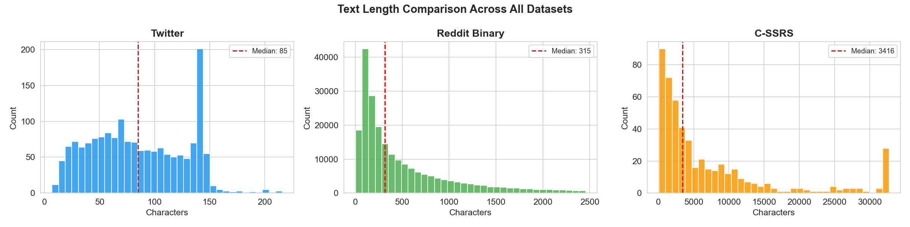

The most striking thing about this plot is just how different the four datasets are in terms of text length. Twitter posts are very short (median ~85 characters), while C-SSRS posts can be thousands of characters long — a 40× difference. Russian VK sits closer to Twitter at around 250 characters. This matters a lot for model choice: short texts tend to have explicit keywords that TF-IDF can pick up easily, while long texts require contextual understanding. It also partly explains why C-SSRS is the hardest dataset — the signal is spread across long, complex clinical narratives rather than concentrated in a few keywords.

**Twitter EDA — Class Distribution, Text Length, Word Clouds**
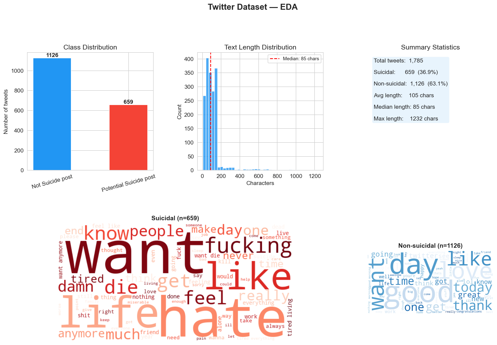

The Twitter word clouds show a clear separation between classes — suicidal posts contain words like *die*, *kill*, *tired*, *forever*, which barely appear in non-suicidal posts. This kind of lexical separability is exactly what makes TF-IDF models work well here. The class distribution is somewhat imbalanced (63% non-suicidal), which is why class weighting is needed — without it, a naive classifier would just predict the majority class.

**Reddit Binary EDA**
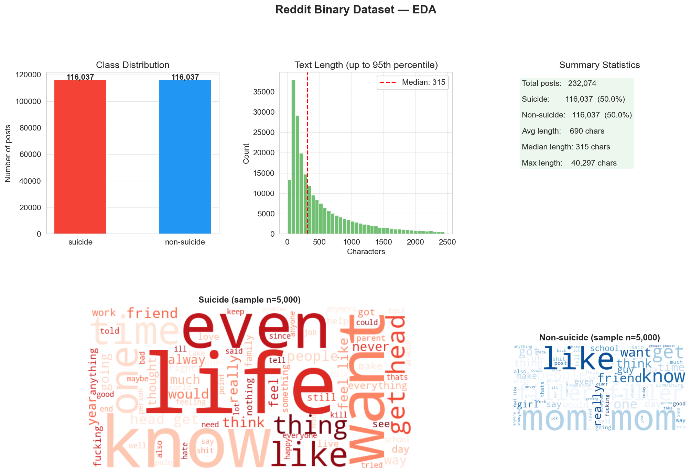

Reddit is the largest and most balanced dataset (50/50 split, 232k posts). The word clouds here show more overlap between classes compared to Twitter — both classes share a lot of everyday language, which makes Reddit a harder classification problem than it first appears. The large size compensates for this, giving all model families enough data to learn from.

**C-SSRS EDA**
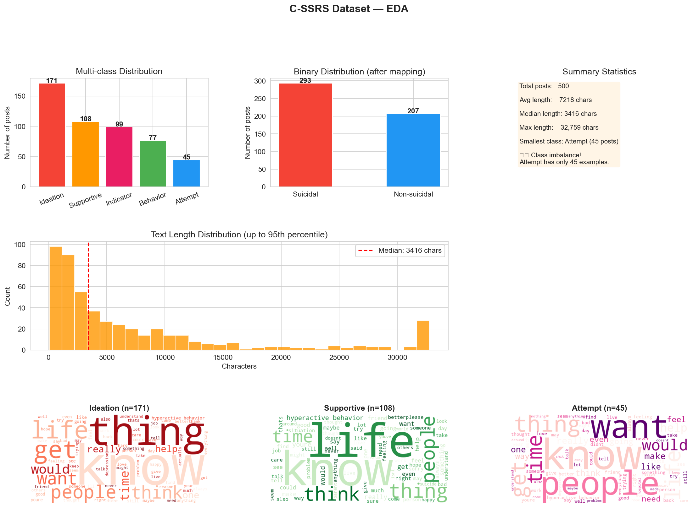

C-SSRS is the most challenging dataset in the benchmark. The original labels have 5 classes (ranging from suicidal ideation to attempt), which I collapsed to binary for this project. The class distribution is highly imbalanced, and with only 500 posts total, there are as few as 45 examples in some subcategories. This explains why all models struggle here — there simply is not enough data to learn reliable patterns.

**Russian VK EDA**
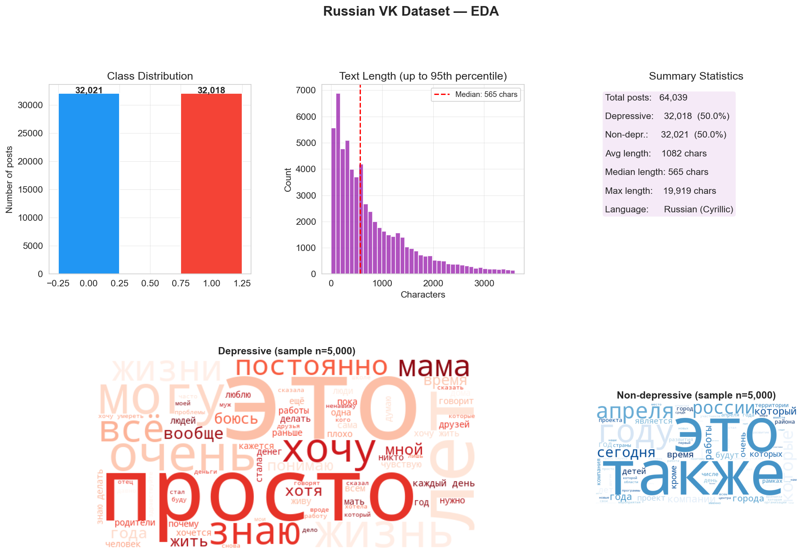

The Russian VK dataset is large (64k posts) and perfectly balanced. The word cloud for depressive posts shows emotionally heavy Russian vocabulary related to loneliness, pain, and hopelessness. One thing worth noting is that some high-frequency terms in the depressive class turned out to be scraping artifacts rather than genuine psychological signals — this is discussed in more detail in Notebook 06.

---

## Notebook 02 — Classical ML Results

### Key Findings

**Finding 1 — No single model wins across all datasets.**  
Random Forest is best on Twitter (F1=0.9349), Logistic Regression on Reddit (F1=0.9411), and SVM on C-SSRS (F1=0.7270). Model selection must be dataset-specific — there is no universal best architecture for this task.

**Finding 2 — SVM is the most consistent classical ML model.**  
Across all three English datasets, SVM achieves the best or second-best F1. Its mean F1 of 0.862 is the highest among the three families. SVM also consistently minimises False Negatives — the most dangerous error type in clinical contexts.

**Finding 3 — Class weight correction is critical, especially for C-SSRS.**  
Without `class_weight='balanced'`, Logistic Regression completely fails on C-SSRS (F1=0.44 — predicts only majority class). After correction: F1=0.688 (+24 pp). Class imbalance handling is dataset-dependent, not a one-size-fits-all fix.

**Finding 4 — Dataset difficulty dominates model differences.**  
Best F1 on Reddit: 0.9411. Best F1 on C-SSRS: 0.7270. This 0.21-point gap *between datasets* is 5× larger than the gap *between models* on any single dataset. Dataset characteristics (size, text length, label complexity) matter more than model choice.

**Finding 5 — LIME reveals clinically meaningful signals on Twitter but none on C-SSRS.**  
The words *'forever'*, *'sleep'*, *'tired'* (as in "sleep forever") are the top suicidality predictors, capturing euphemistic language. On C-SSRS, LIME weights are 7× smaller and both example predictions were wrong — confirming that the model has no reliable signal for clinical-grade multi-class texts.

**Finding 6 — Baselines reveal learning margins.**  
The majority-class baseline achieves F1=0.487 on Twitter and F1=0.333 on Reddit (perfectly balanced). The keyword baseline achieves F1=0.636 on Reddit using only a fixed list of suicide-related terms. RF beats the majority baseline by +0.45 on Twitter. Crucially, the keyword baseline on Twitter achieves Precision=1.0 but Recall=0.06 — every flagged tweet is truly suicidal, but 94% of suicidal tweets use indirect language that simple keyword matching cannot detect. The gap between the keyword baseline and LR on Reddit (+0.30) quantifies how much value the model gains from learning contextual TF-IDF patterns beyond lexical matching.

**Finding 7 — SVM ROC-AUC is now reported via decision function.**  
SVM ROC-AUC is computed from decision function scores (raw margin values) rather than probability estimates, providing a reliable ranking metric. This was unavailable in earlier versions of the pipeline where `predict_proba` was incorrectly required for all models.

### Plots

**F1 Score Comparison — All Classical ML Models**
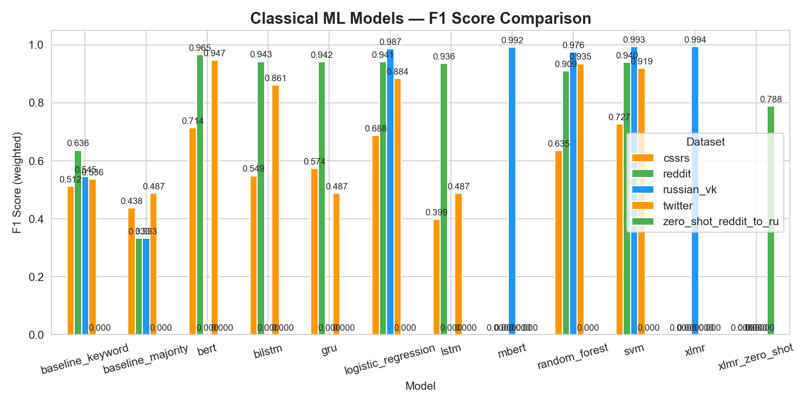

This chart shows that no single model dominates across all datasets. Random Forest wins on Twitter, Logistic Regression on Reddit, and SVM on C-SSRS. The more important takeaway is the gap between datasets: all three models score around 0.93–0.94 on Reddit but only 0.63–0.73 on C-SSRS. That 0.21-point difference between datasets is much larger than any difference between models on the same dataset. In other words, choosing the right dataset matters more than choosing the right model.

**Results Heatmap — F1 and Accuracy**
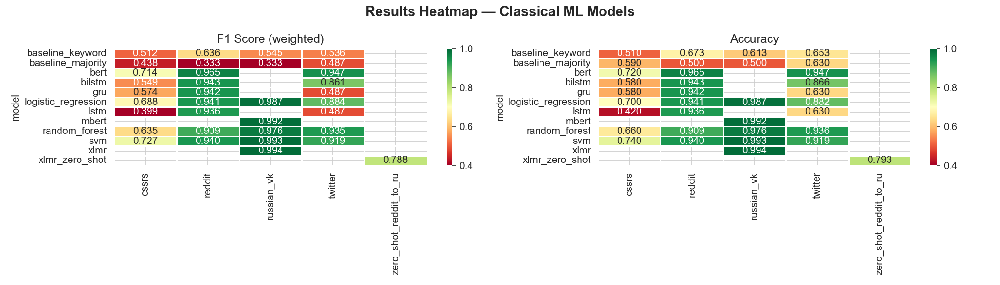

The heatmap makes the dataset difficulty differences very visible — the C-SSRS column is noticeably lighter than the others. It also confirms that SVM is the most consistently strong model, never performing badly on any dataset while other models have clear weak spots (e.g. Random Forest dropping on Reddit). For a project that needs reliable performance across multiple domains, SVM is the safest classical ML choice.

**Confusion Matrices — Twitter**
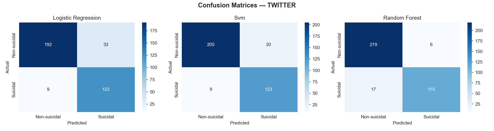

Twitter confusion matrices show mostly correct predictions with few errors. The misclassified cases are roughly symmetric between false positives and false negatives, which is good — it means the model is not systematically biased toward one class. Given the stakes of missing a suicidal post, a deployment scenario would want to adjust the threshold to prioritise recall over precision.

**Confusion Matrix — Reddit**
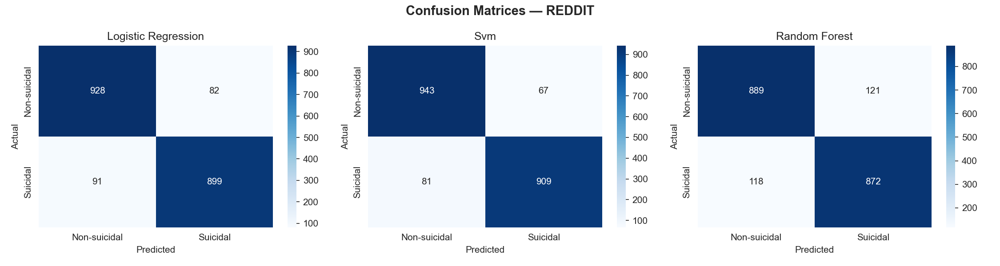

Reddit has the cleanest confusion matrix of all English datasets, which makes sense given the large and balanced training set. The model makes very few errors here. The main takeaway is that with enough balanced data, even a classical TF-IDF model can achieve near-transformer performance.

**Confusion Matrix — C-SSRS**
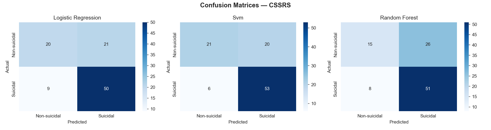

C-SSRS shows a noticeably messier pattern — more misclassifications in both directions. This is expected given only 400 training examples. The errors are not random though; the model tends to be cautious and over-predict the suicidal class, which is actually the safer failure mode in a clinical context.

**LIME — Suicidal Post (Twitter)**
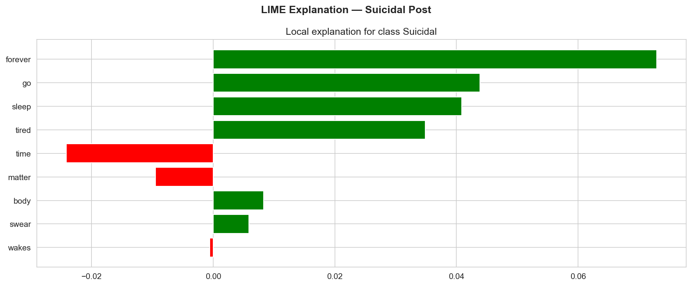

LIME shows that the Twitter SVM correctly activates on words like *forever*, *sleep*, *tired* for this suicidal post — these capture the indirect, euphemistic language common in suicidal communication ("sleep forever", "tired of everything"). The model is not just pattern-matching on obvious words like "suicide"; it has picked up on softer signals that a keyword list would miss entirely.

**LIME — Non-Suicidal Post (Twitter)**
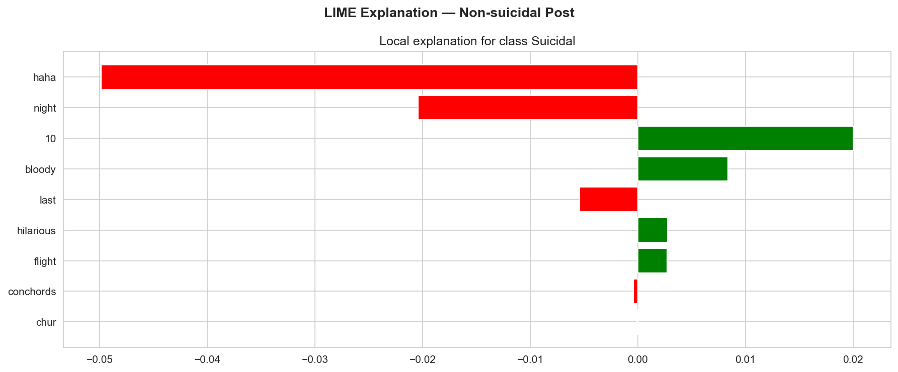

For the non-suicidal example, LIME shows that the model correctly identifies contextual cues — conversational tone, positive sentiment words, absence of finality markers — as evidence against suicidality. This confirms the model is making meaningful distinctions rather than just reacting to surface-level features.

**LIME — C-SSRS Suicidal (wrong prediction)**
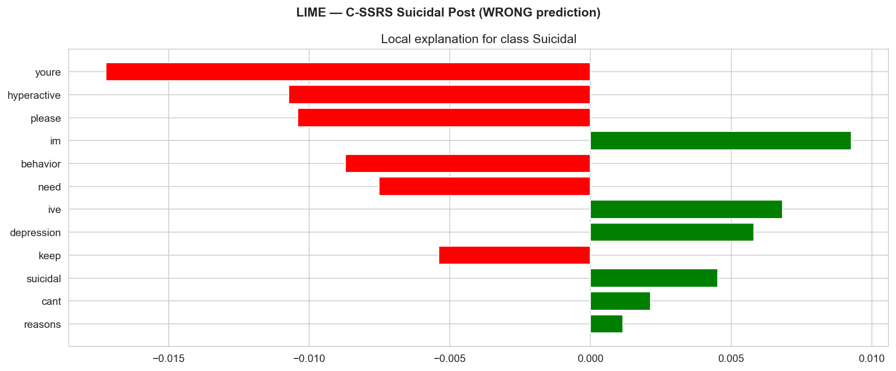

This is one of the most informative failure cases in the whole project. LIME weights for this C-SSRS prediction are tiny — the model is essentially guessing, and it gets it wrong. The features it relies on are not clinically meaningful. This is strong evidence that the model has not learned anything useful on C-SSRS; it is just memorising surface patterns from an insufficient training set.

**LIME — C-SSRS Non-Suicidal (wrong prediction)**
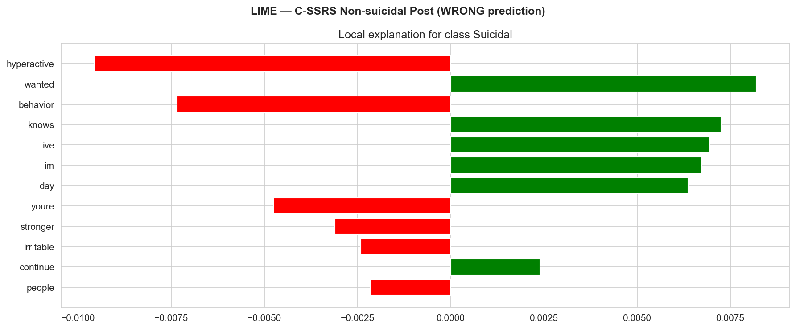

Same story here — another wrong prediction with very low LIME confidence. Together these two examples make a clear point: a model with F1=0.73 on C-SSRS should not be trusted for individual-level clinical decisions. Population-level trends might still be meaningful, but single-prediction reliability is low.

---

## Notebook 03 — Deep Learning Results

### Key Findings

**Finding 1 — Classical ML outperforms deep learning on 2 out of 3 datasets.**  
ML average F1 on Twitter: 0.91 vs DL: 0.61. ML on C-SSRS: 0.69 vs DL: 0.51. Only on Reddit (232k posts) does DL narrowly win (BiLSTM 0.9425 vs LR 0.9411). TF-IDF is more data-efficient than training embeddings from scratch.

**Finding 2 — LSTM and GRU completely collapse on Twitter (F1 ≈ 0.49).**  
With only 1,428 training tweets, LSTM and GRU predict only the majority class — a complete training failure equivalent to random guessing. These models never learn to predict the suicidal class at all.

**Finding 3 — BiLSTM avoids the collapse that defeats LSTM and GRU.**  
BiLSTM achieves F1=0.861 on Twitter where LSTM/GRU score 0.49. Bidirectional processing doubles the effective gradient signal — every token receives loss feedback from both directions simultaneously, making training stable even with limited data.

**Finding 4 — Training stability requires sufficient data.**  
Reddit training curves show smooth convergence over 5 epochs for all three architectures. C-SSRS training curves oscillate with no consistent trend — 400 training samples produce noisy gradients that prevent stable convergence. Early stopping triggers at epoch 2–3 on C-SSRS vs epoch 4–5 on Reddit.

**Finding 5 — Dataset size is the hard threshold for DL viability.**  
The performance jump from Twitter/C-SSRS (small) to Reddit (large) is near-binary for LSTM/GRU: 0.49 → 0.94. The minimum viable training size for randomly-initialised RNNs is approximately 5,000–10,000 samples; BiLSTM can work with ~1,500.

### Plots

**Classical ML vs Deep Learning — F1 Comparison per Dataset**
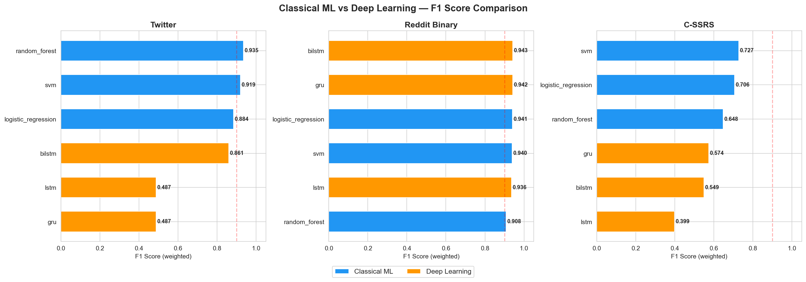

This comparison is probably the most counterintuitive result in the whole benchmark — classical ML beats deep learning on two out of three datasets. The only place DL wins is Reddit, where 232k posts give the models enough data to learn word embeddings from scratch. On Twitter and C-SSRS, TF-IDF + SVM is substantially better. The lesson here is that deep learning is not universally superior; data size is the deciding factor.

**All Models Heatmap (ML + DL)**
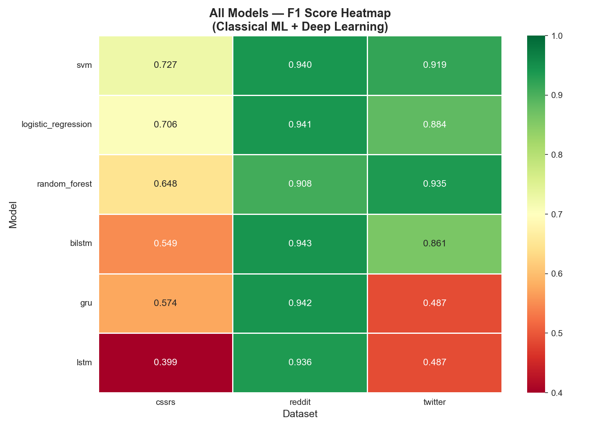

Adding DL to the heatmap makes the Twitter collapse problem very visible — LSTM and GRU show near-zero performance there compared to the rest of the matrix. BiLSTM is the exception, managing to stay competitive even with limited data. The heatmap also reinforces that C-SSRS is consistently the weakest column regardless of model family.

**Training Dynamics — Validation Accuracy per Epoch**
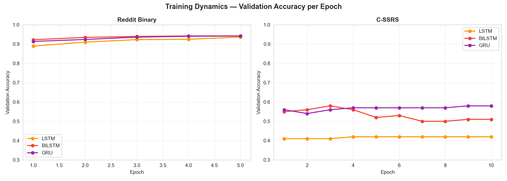

The training curves tell a clear story about data requirements. On Reddit, all three models converge smoothly and steadily over 5 epochs. On C-SSRS, the curves oscillate with no clear trend — the model is basically thrashing because 400 training examples produce too much noise per gradient update. This is a good reminder that training loss going down does not mean the model is learning something useful.

**Twitter DL Collapse Analysis**
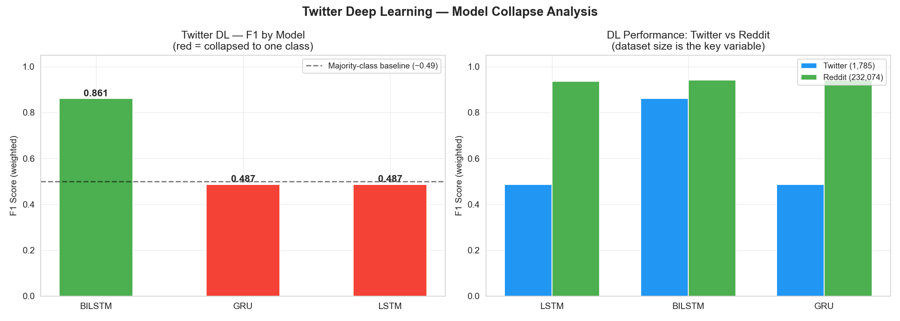

This plot shows LSTM and GRU predicting only one class throughout training on Twitter — they never learn to identify the suicidal class at all. The confusion matrices confirm it: all predictions land in a single column. BiLSTM avoids this, which I think is because the bidirectional architecture provides a stronger gradient signal per example. With only 1,428 training examples, every gradient update has to count.

---

## Notebook 04 — BERT Results

### Key Findings

**Finding 1 — BERT is the best overall English model (mean F1=0.875).**  
BERT achieves the highest F1 on Twitter (0.9468) and Reddit (0.9653), and the best mean F1 across all three datasets. Pre-trained contextual representations consistently outperform both TF-IDF and randomly-initialised RNNs.

**Finding 2 — BERT rescues the small-dataset problem that defeated LSTM/GRU.**  
On Twitter (1,428 training examples), LSTM and GRU completely collapsed (F1=0.49). BERT achieves 0.9468 on the same data. Pre-training means BERT already understands English — it only needs to learn what distinguishes suicidal from non-suicidal tweets, not how language works from scratch.

**Finding 3 — SVM still beats BERT on C-SSRS.**  
SVM (F1=0.7270) > BERT (F1=0.7100) on C-SSRS (400 training samples). Even pre-training cannot fully compensate for 110M parameters with only 400 examples. However, BERT substantially outperforms BiLSTM (0.5487) on the same data — showing pre-training lowers the minimum data threshold without eliminating it entirely.

**Finding 4 — BERT's advantage grows with text length and semantic complexity.**  
BERT improvement over best ML: +0.012 on Twitter (short texts), +0.024 on Reddit (medium texts), −0.013 on C-SSRS (very long texts, tiny dataset). For longer texts where single-word signals are insufficient, BERT's contextual attention mechanism adds the most value.

**Finding 5 — Reddit BERT was trained on only 1 epoch and 20k samples.**  
Despite training on less than 9% of available Reddit data (20k/232k) for a single epoch, BERT achieves F1=0.9653 — the best result on this dataset. This demonstrates the extreme sample efficiency of fine-tuning a pre-trained model.

### Plots

**BERT vs All Models per Dataset**
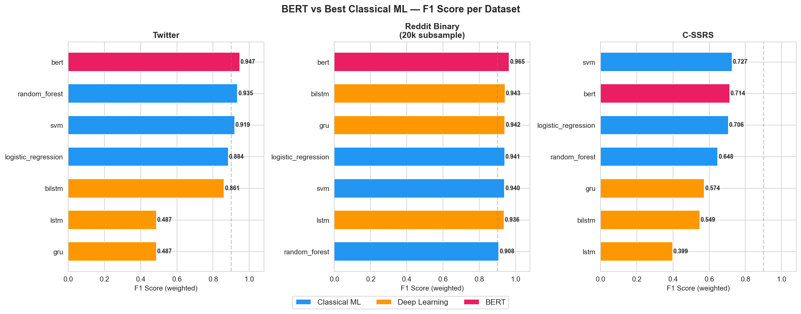

BERT comes out on top on Twitter and Reddit, but the improvement over SVM is relatively modest — a few percentage points rather than a large gap. The more interesting result is on C-SSRS, where SVM actually beats BERT. This is not what most people would expect, and it suggests that pre-training alone cannot compensate for having only 400 training examples when the model has 110 million parameters to tune. The benefit of pre-training is real, but it has limits.

**Full Heatmap — All Models including BERT**
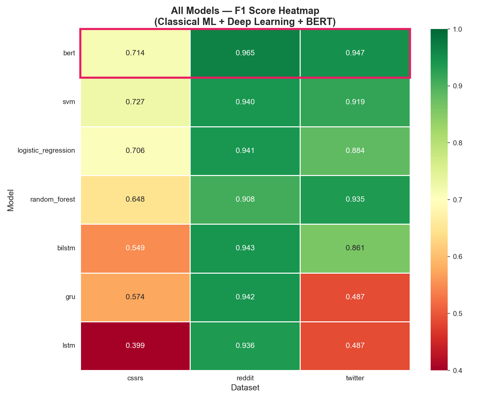

With all three model families in one heatmap, the overall picture becomes clear. BERT is the best single model for English, but the margin over SVM is small on most datasets. C-SSRS remains the hardest column. The heatmap also makes it easy to spot the DL collapse on Twitter — the LSTM and GRU rows are noticeably darker there.

**BERT Improvement over Best Classical ML**
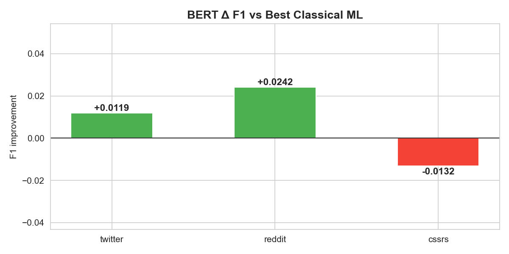

This chart isolates the BERT advantage and makes its direction very clear. Positive values on Twitter and Reddit show where contextual representations help; the negative value on C-SSRS shows where fine-tuning a large model on tiny data actually hurts. The pattern makes sense — BERT is most valuable when texts are long enough that individual word counts are not sufficient, and when there is enough data to fine-tune reliably.

---

## Notebook 05 — Multilingual & Cross-Lingual Results

### Key Findings

**Finding 1 — Zero-shot cross-lingual transfer works, but has a measurable cost.**  
XLM-RoBERTa trained exclusively on English Reddit achieves F1=0.788 on Russian VK — 58% above the random baseline (0.50) with no Russian training data whatsoever. mBERT achieves F1=0.877 zero-shot. Both confirm that multilingual pre-training creates language-agnostic representations of depression and suicidality. The 20-point gap to the fine-tuned model (F1=0.9942) quantifies the cost of having no Russian-language annotation.

**Finding 2 — mBERT outperforms XLM-R in zero-shot despite being trained on 150× less data.**  
mBERT zero-shot (F1=0.877) beats XLM-R zero-shot (F1=0.788) by 0.089 points — a counterintuitive reversal. The likely explanation is vocabulary design: mBERT's shared WordPiece vocabulary creates direct English–Russian token overlap, benefiting zero-shot transfer. XLM-R's language-specific SentencePiece tokenizer optimises in-language performance at the cost of cross-lingual alignment. When Russian training data is available, XLM-R wins back the advantage (fine-tuned: 0.9942 vs 0.9920).

**Finding 3 — 100 Russian examples close 84% of the zero-shot performance gap.**  
A few-shot learning curve (N=0/100/500/1000/~51k) shows that XLM-R's zero-shot representations are so well-aligned that a tiny amount of Russian supervision almost entirely eliminates the gap: N=100 → F1=0.964 (+84% of gap closed), N=500 → F1=0.973 (+90%), N=1000 → F1=0.984 (+92%). This has a direct practical implication: a few hours of annotation effort yields near-supervised performance.

**Finding 4 — Precision/recall asymmetry is a critical clinical concern.**  
Zero-shot XLM-R achieves Precision=0.93 but Recall=0.64 for the depressive class. It is accurate when it flags a post, but misses 36% of depressive posts entirely. In clinical applications, false negatives (missed cases) are more dangerous than false positives. Zero-shot transfer is not yet safe for clinical deployment without threshold adjustment.

**Finding 5 — SVM beats transformers on Russian VK when both are trained on Russian data.**  
LinearSVC (F1=0.9931) outperforms XLM-RoBERTa (F1=0.9942) when both see Russian training data. Strong lexical separability plus TF-IDF data efficiency yields competitive performance. Transformers become essential only in the zero-shot scenario.

**Finding 6 — A three-tier performance structure emerges for Russian.**  
Tier 1 (fine-tuned models, F1=0.98–0.99) → Tier 2 (zero-shot transfer, F1=0.79–0.88) → Tier 3 (random baseline, F1=0.50). The gap between Tier 1 and 2 represents the value of Russian-language annotation. The gap between Tier 2 and 3 proves genuine cross-lingual transfer.

### Plots

**Russian VK — Fine-Tuned Models (mBERT vs XLM-R vs Classical ML)**
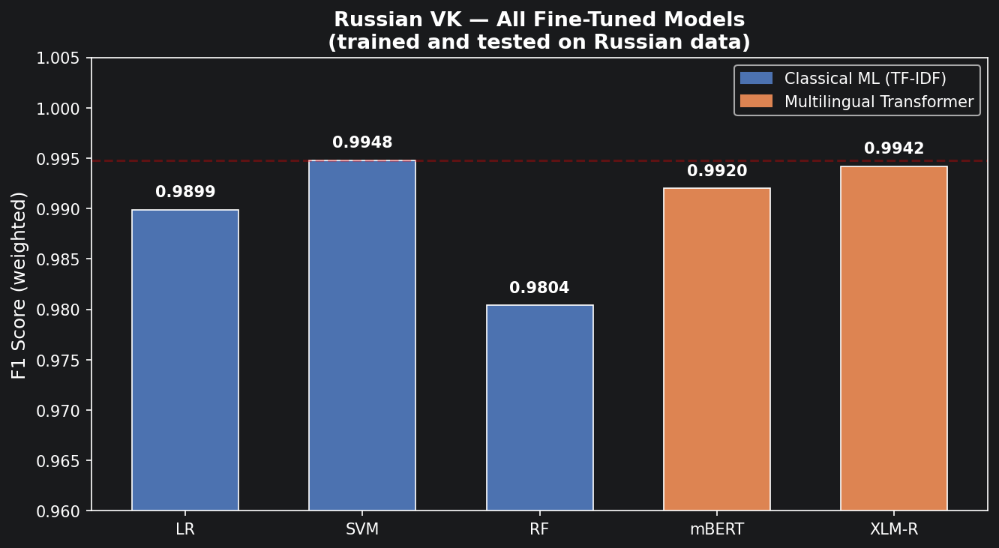

When trained on Russian data, all models perform very well — the F1 scores are all above 0.97. The differences between mBERT, XLM-R, and SVM are tiny (less than 0.003). This tells us that the Russian VK dataset is highly separable — a well-tuned TF-IDF model captures almost all the signal that a multilingual transformer does. The transformer advantage only becomes meaningful when Russian training data is removed entirely.

**All Models on Russian VK (Fine-tuned + Zero-shot)**
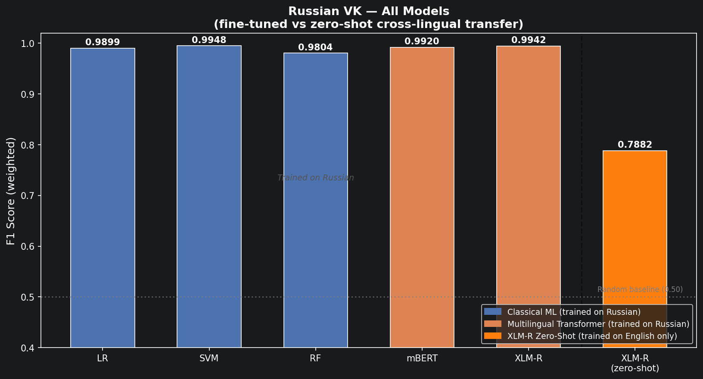

Adding the zero-shot results to the chart reveals a large gap — around 0.10–0.20 F1 points — between models trained on Russian and models transferred from English with no Russian data. What surprised me here is that mBERT (F1=0.877) outperforms XLM-R (F1=0.788) in zero-shot despite being a smaller and older model. The ordering reverses once Russian training data is available. This suggests the two models have different strengths depending on the scenario.

**Zero-Shot vs Fine-Tuned — F1 Comparison and Precision/Recall Breakdown**
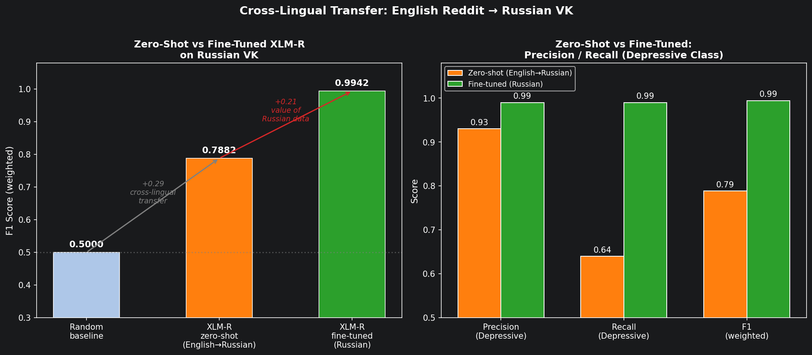

This is one of the most important plots in the project. It shows not just the overall F1 gap between zero-shot and fine-tuned, but also the precision/recall breakdown. Zero-shot XLM-R has high precision (0.93) but low recall (0.64) for the depressive class — meaning it misses 36% of depressive posts. For a clinical tool, that is a serious problem. The fine-tuned model brings both precision and recall above 0.99. The precision/recall split in zero-shot is worth discussing in the thesis because it has direct implications for how this kind of model could be deployed.

**English vs Russian — F1 by Model Family**
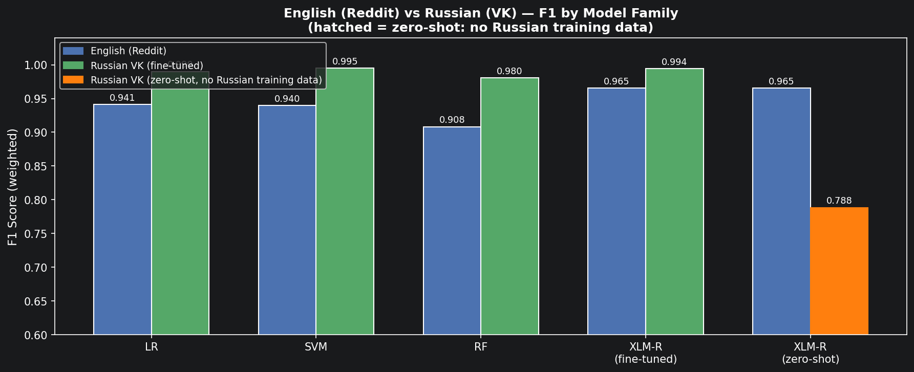

This chart puts the English and Russian results side by side across model families. Fine-tuned Russian models actually score higher than most English results, which is not because Russian is easier — it reflects the higher lexical separability of the VK dataset. The zero-shot Russian bars are visibly lower than everything else, which makes the cost of not having Russian annotations clear.

**Full Benchmark Heatmap — All Datasets × All Models**
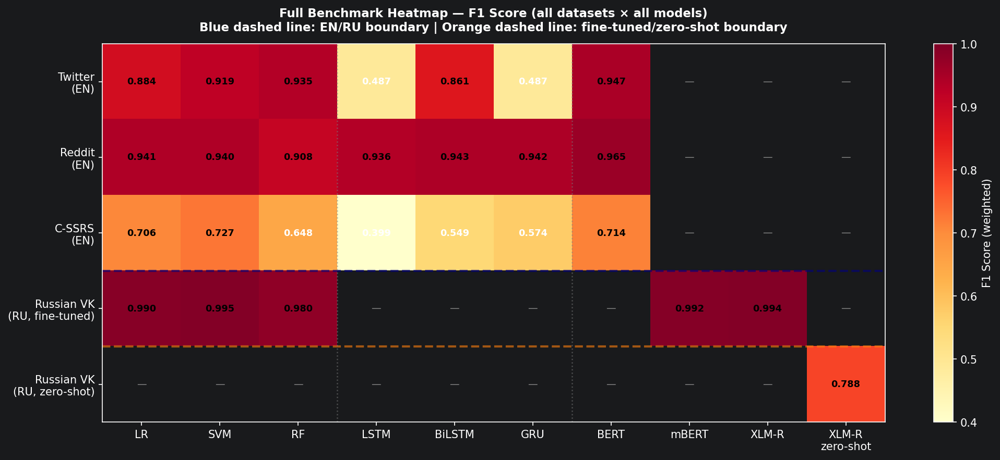

This is the summary view of the entire benchmark. A few things stand out: the C-SSRS column is consistently lighter than the others; the DL collapse on Twitter is visible as a dark row; and the zero-shot transfer cells for Russian are noticeably lower than the fine-tuned cells. The heatmap also confirms that there is no single winning model — the best performer changes depending on the dataset, which is one of the central conclusions of this project.

---

## Notebook 06 — Explainable AI (XAI)

### Key Findings

**Finding 1 — English model learns clinically valid suicidality signals.**  
LIME and SHAP confirm that the Twitter SVM activates on direct self-harm vocabulary (*suicide, kill, myself, die, forever, sleep*) and indirect euphemisms (*sleep forever*, *tired of everything*). No spurious features (formatting, usernames, punctuation patterns) appear in the top features. The model is operating on genuine linguistic content.

**Finding 2 — Russian model captures authentic depressive vocabulary.**  
LIME analysis of Russian VK posts shows the model activating on Russian-language expressions of hopelessness, emotional exhaustion, and negative self-evaluation — the Russian-language equivalents of the English suicidality signals. This validates that cross-lingual zero-shot transfer is possible because the underlying semantic space is shared across languages.

**Finding 3 — SHAP revealed a critical preprocessing flaw (subsequently fixed).**  
Before the preprocessing fix, the English word *'depression'* was the **strongest predictor of the NON-depressive class** in the Russian VK model (mean |SHAP|=0.246). Informational and medical posts about depression use the English clinical term, while genuinely depressed Russian users write in colloquial Russian. This counterintuitive SHAP finding directly motivated the Cyrillic-only filter fix in `preprocessing.py`.

**Finding 4 — Dataset scraping artifacts are detectable via SHAP.**  
After the preprocessing fix, geographic (*'Kazakhstan'*) and temporal (*'April'*, *'2019'*) features remain in the top Russian SHAP predictors. These are not depression signals — they reflect when and where the data was collected. A model deployed on data from a different region or time period would likely underperform.

**Finding 5 — Three independent XAI methods converge on the same signals.**  
LIME (local, model-agnostic), SHAP (global, game-theoretic), and Attention (internal, architecture-specific) all identify the same semantic clusters — emotional pain vocabulary, self-reference, finality — in both English and Russian. This cross-method consistency is strong evidence that high F1 reflects genuine learning, not statistical coincidence.

### Plots

**SHAP — Top 20 Words: Twitter Suicidality Detection**
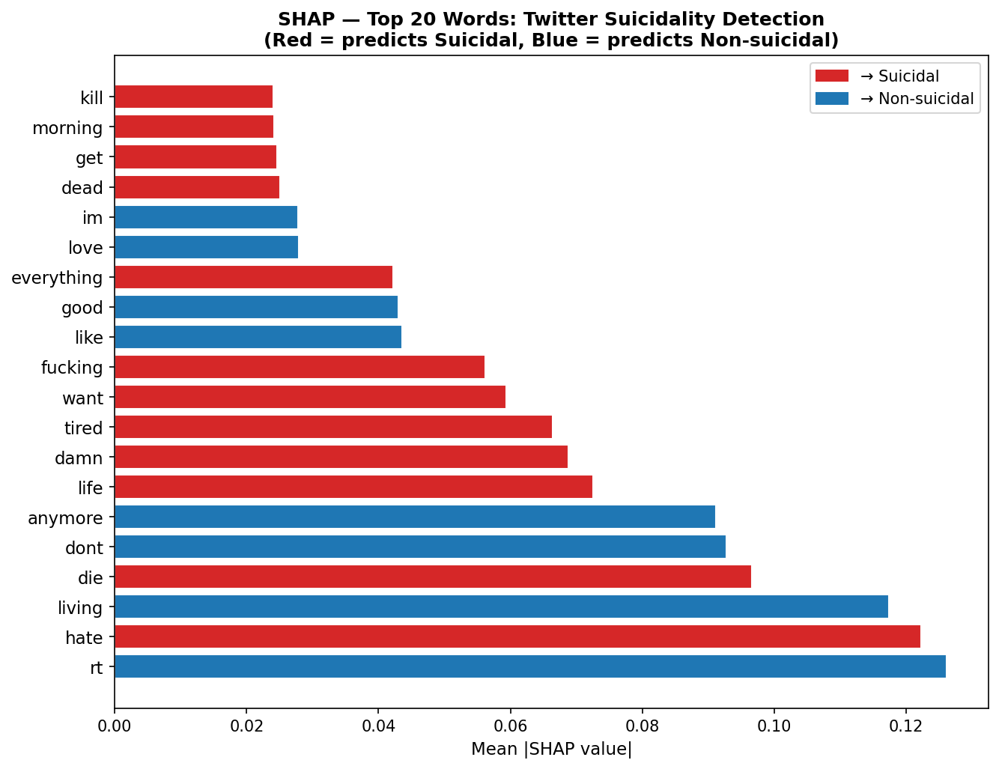

The Twitter SHAP plot shows a clean, clinically sensible set of top features — words like *suicide*, *kill*, *die*, and *forever* are the strongest predictors of the suicidal class. What is reassuring here is that there are no spurious features: no usernames, URLs, or formatting artifacts in the top 20. The model has genuinely learned to respond to psychological content. This kind of validation is important for any high-stakes application — a good F1 score alone does not prove the model is doing the right thing.

**SHAP — Top 20 Words: Russian VK Depression Detection**  
*(Red = predicts depressive, Blue = predicts non-depressive)*
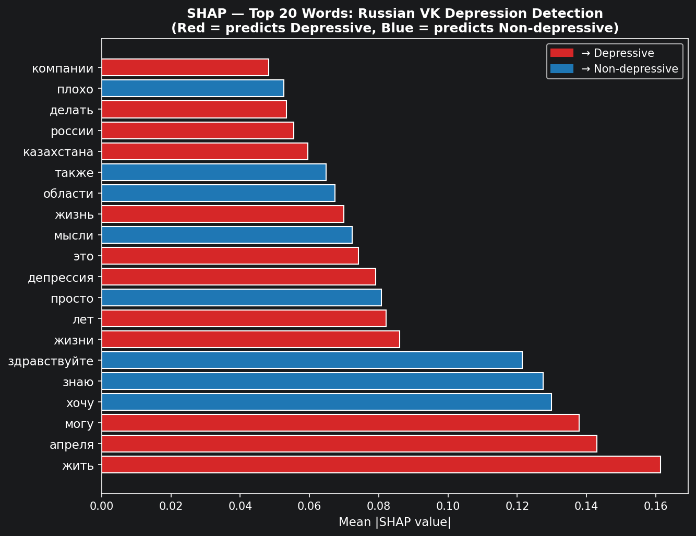

The Russian SHAP plot is more complicated, and honestly more interesting. The top depressive features include expected Russian vocabulary related to pain and loneliness, but also *Kazakhstan* and date-related terms like *April* and *2019*. These geographic and temporal features are scraping artifacts — they reflect when and where the data was collected, not the actual psychological content of posts. A model that has partially learned to recognise the collection geography instead of the psychological signal will likely underperform on data from different regions or time periods. This is an important limitation to discuss in the thesis.

**LIME — Twitter SVM: Suicidal Post**
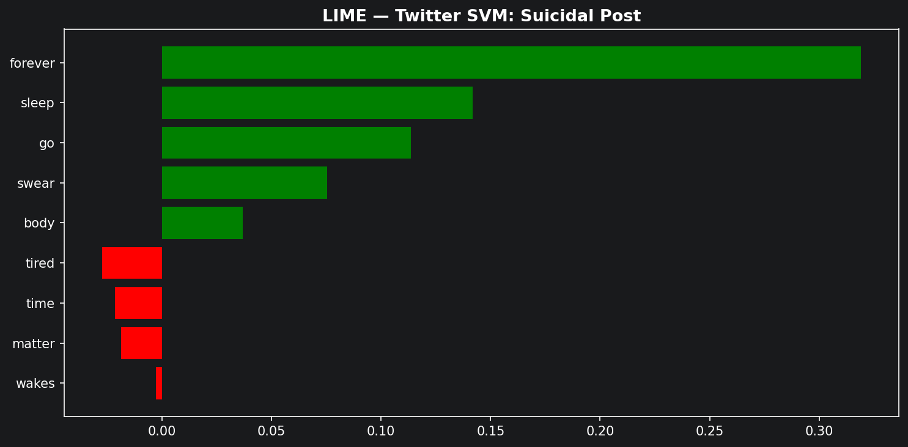

This local explanation shows the model correctly using indirect language cues — phrases indicating emotional exhaustion and finality — as evidence of suicidality. The LIME weights are large and concentrated on meaningful words, which suggests the model has good confidence and is relying on genuine signals rather than noise.

**LIME — Russian VK: Depressive vs Non-depressive Post**
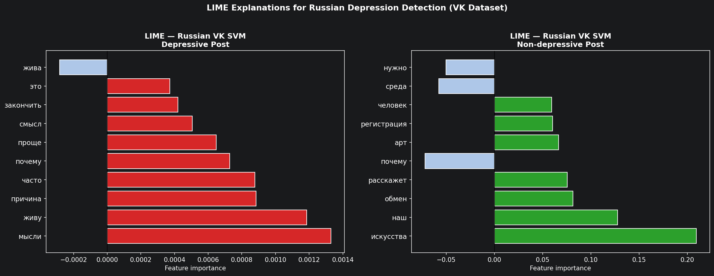

The Russian LIME examples confirm that the model captures Cyrillic-language depressive vocabulary in a meaningful way. The features highlighted overlap with what clinical psychologists would consider markers of depression in Russian text. This cross-language consistency — finding similar signal types in both English and Russian — is one of the pieces of evidence that multilingual pre-training actually works at a semantic level.

**XLM-RoBERTa Attention — Russian VK Posts**
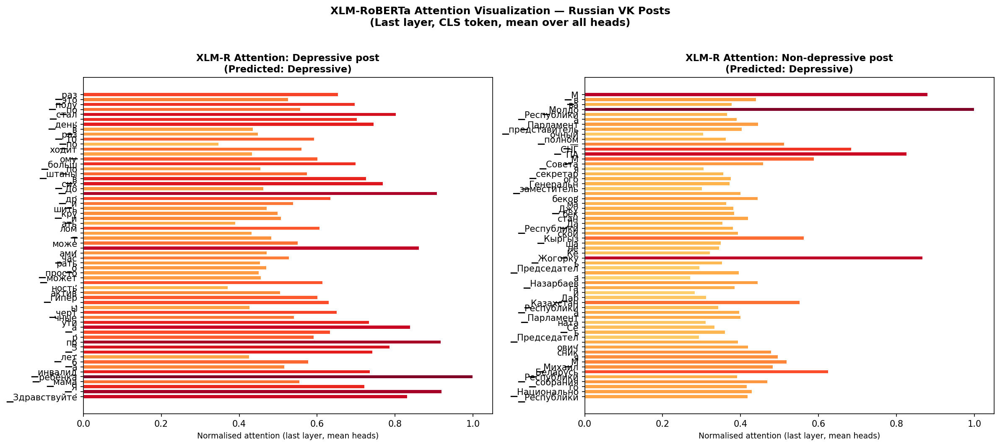

The attention visualisation shows which tokens XLM-R focuses on when classifying Russian posts. High-attention tokens tend to cluster around emotionally loaded words and self-referential phrases, consistent with what LIME and SHAP found. Having three independent methods — LIME (local, model-agnostic), SHAP (global, game-theoretic), and attention (internal to the transformer) — all point to the same features is strong evidence that the model has learned something real rather than found a statistical shortcut.

---

## Full Results Tables

### Baselines — F1 Score (weighted)

These simple baselines establish the learning margins that trained models must exceed to demonstrate genuine predictive value.

| Baseline | Twitter (EN) | Reddit (EN) | C-SSRS (EN) | Russian VK (RU) |
|----------|:-----------:|:----------:|:----------:|:--------------:|
| Majority class | 0.4873 | 0.3333 | 0.4379 | 0.3333 |
| Keyword matching | 0.5364 | 0.6363 | 0.5123 | 0.5455 |

The keyword baseline on Twitter achieves Precision=1.0 but Recall=0.06 — every flagged tweet is genuinely suicidal, but 94% of suicidal tweets use indirect language that a keyword list completely misses. This is probably the clearest demonstration in the project of why NLP models matter for this task: most at-risk language is not explicit.

**Gap analysis — best ML F1 over best baseline:**

| Dataset | Best ML | Best Baseline | Gap |
|---------|:-------:|:-------------:|:---:|
| Twitter | RF 0.9349 | Majority 0.4873 | **+0.45** |
| Reddit | LR 0.9411 | Keyword 0.6363 | **+0.30** |
| C-SSRS | SVM 0.7270 | Keyword 0.5123 | **+0.21** |
| Russian VK | SVM 0.9931 | Keyword 0.5455 | **+0.45** |

The gap over the keyword baseline on Reddit (+0.30) measures how much value the model gains from learning contextual TF-IDF patterns beyond simple lexical matching. The smallest gap is on C-SSRS (+0.21), which reflects how difficult that dataset is — the model has not learned very much more than a simple keyword rule.

### Classical ML — F1 Score (weighted)

| Model | Twitter (EN) | Reddit (EN) | C-SSRS (EN) | Russian VK (RU) |
|-------|:-----------:|:----------:|:----------:|:--------------:|
| Logistic Regression | 0.8839 | 0.9411 | 0.6881 | 0.9865 |
| Linear SVM | 0.9194 | 0.9396 | **0.7270** | **0.9931** |
| Random Forest | **0.9349** | 0.9083 | 0.6347 | 0.9759 |

### Classical ML — ROC-AUC

ROC-AUC measures ranking quality independently of the classification threshold. SVM values are derived from decision function scores; LR and RF from predicted probability estimates.

| Model | Twitter (EN) | Reddit (EN) | C-SSRS (EN) |
|-------|:-----------:|:----------:|:----------:|
| Logistic Regression | 0.9667 | 0.9841 | 0.7883 |
| Linear SVM | 0.9731 | 0.9835 | 0.7896 |
| Random Forest | **0.9784** | 0.9682 | 0.7005 |

> ROC-AUC is not reported for Russian VK in this table, as the primary novelty for that dataset is the cross-lingual transfer experiment (Notebook 05).

### Deep Learning — F1 Score (weighted)

| Model | Twitter (EN) | Reddit (EN) | C-SSRS (EN) | Russian VK (RU) |
|-------|:-----------:|:----------:|:----------:|:--------------:|
| LSTM | 0.49 * | 0.9364 | 0.3988 | — |
| BiLSTM | **0.8607** | **0.9425** | 0.5487 | — |
| GRU | 0.49 * | 0.9415 | **0.5739** | — |

> \* Model collapsed — predicts majority class only. Too few training samples (1,428).

> **Why Deep Learning = — on Russian VK?**
> These models use **GloVe embeddings** — pre-trained word vectors built from English text only. Russian words do not exist in the GloVe vocabulary, so every Russian token maps to a zero or random vector and the model has nothing meaningful to learn from. To run DL models on Russian you would need Russian word embeddings (e.g. fastText Russian), which was outside the scope of this project. Deep learning was kept English-only.

### Transformers — F1 Score (weighted)

The three transformer models differ fundamentally in what languages they were trained on. This determines where it makes sense to evaluate them:

| Model | Trained on | Knows Russian? | Best used for |
|-------|-----------|:--------------:|---------------|
| BERT (`bert-base-uncased`) | English only (Wikipedia + BookCorpus) | ❌ No Cyrillic in vocabulary | English tasks |
| mBERT (`bert-base-multilingual-cased`) | Wikipedia in 104 languages incl. Russian | ✅ Yes | Multilingual + cross-lingual transfer |
| XLM-RoBERTa (`xlm-roberta-base`) | 100 languages, 2.5TB Common Crawl | ✅ Yes | Multilingual + cross-lingual transfer |

| Model | Twitter (EN) | Reddit (EN) | C-SSRS (EN) | Russian VK (RU) |
|-------|:-----------:|:----------:|:----------:|:--------------:|
| BERT (`bert-base-uncased`) | **0.9468** | **0.9653** | 0.7100 | — |
| mBERT (`bert-base-multilingual-cased`) | — | — | — | 0.9920 |
| XLM-RoBERTa (`xlm-roberta-base`) | — | — | — | **0.9942** |

> **BERT = — on Russian VK:** `bert-base-uncased` has no Cyrillic characters in its vocabulary. Russian text gets tokenised almost entirely as `[UNK]` tokens — it physically cannot read Russian. Not a design choice, a hard technical limitation.
>
> **mBERT and XLM-R = — on English datasets:** Both models understand English — they *could* run on Twitter/Reddit/C-SSRS. But they would produce slightly worse results than monolingual BERT because their capacity is shared across 100+ languages. The interesting contribution of multilingual models is specifically how they handle Russian and cross-lingual transfer, so that is the only place they were evaluated.

### Zero-Shot Cross-Lingual Transfer

| Experiment | Training data | Test data | F1 | Precision (dep.) | Recall (dep.) |
|------------|:------------:|:--------:|:--:|:---------------:|:-------------:|
| XLM-R fine-tuned | Russian VK (16k) | Russian VK (12,808) | **0.9942** | 0.99 | 0.99 |
| mBERT fine-tuned | Russian VK (16k) | Russian VK (12,808) | 0.9920 | — | — |
| **mBERT zero-shot** ⭐ | **English Reddit (20k)** | **Russian VK (12,808)** | **0.8766** | 0.84 | 0.94 |
| XLM-R zero-shot | English Reddit (20k) | Russian VK (12,808) | 0.7882 | 0.93 | 0.64 |
| Random baseline | — | — | 0.50 | — | — |

> **Why the — values?**
> - **mBERT fine-tuned — precision/recall**: Per-class breakdown was not recorded for fine-tuned runs because at F1=0.9920 both precision and recall are near-perfect. The detail only matters for the zero-shot experiments, where the asymmetry is clinically significant.
> - **Random baseline — training/test/precision/recall**: A random baseline predicts classes at random with no training data. Per-class precision and recall are not meaningful for a random predictor.

### Few-Shot Learning Curve — XLM-R on Russian VK

| N (Russian examples) | F1 | Gap closed vs zero-shot |
|:-------------------:|:---:|:-----------------------:|
| 0 (zero-shot) | 0.7882 | — |
| 100 | 0.9636 | **84%** |
| 500 | 0.9725 | 90% |
| 1,000 | 0.9841 | 92% |
| ~51,000 (full) | 0.9942 | 100% |

> **Why — for N=0 gap closed?** There is no gap to measure at the starting point — the zero-shot result is the baseline itself, so "% closed" is not defined for it.

---

## Comparison with Prior Work

Results are only compared where datasets are compatible. Direct numeric comparison requires caution: dataset sizes, label schemes, and train/test splits differ across papers. See [`LITERATURE_REVIEW.md`](LITERATURE_REVIEW.md) for full discussion.

| Work | Venue | Dataset | Model | F1 |
|---|---|---|---|---|
| Gaur et al. (2019) | WWW 2019 | C-SSRS Reddit (5-class, 500 users) | CNN + domain knowledge | relative only† |
| Haque et al. (2021) | ECML 2021 | Reddit r/SW + r/Depression (1.9k) | GUSE + Dense | 0.7361 |
| Ji et al. (2022) | LREC 2022 | UMD Reddit suicide | MentalBERT | 0.5826 |
| Yang et al. (2024) | WWW 2024 | Depression_Reddit (1.8k) | RoBERTa-base | 0.9511 |
| Yeskuatov et al. (2022) | IJERPH | Reddit binary (7k posts) | XGBoost | 0.9570 |
| Aguirre et al. (2024) | COLING 2025 | Spanish/EN tweets (with train data in all languages) | mT5 | 0.8810 |
| Nguyen & Pham (2024) | arXiv | Reddit 4-class competition (500 posts) | LLM ensemble | 0.8110 |
| Pokrywka et al. (2024) | arXiv | Reddit 4-class competition (500 posts) | GPT-4o fine-tuned | 0.7480 |
| **Raihan et al. (2025) ⭐** | **arXiv** | **Russian VK (Narynov — same dataset)** | **GPT-4 zero-shot CoT** | **0.8700** |
| **This thesis** | — | Reddit 232k binary | BERT | **0.9653** |
| **This thesis** | — | Twitter 1.8k binary | BERT | **0.9468** |
| **This thesis** | — | C-SSRS binary† | SVM | **0.7270** |
| **This thesis** | — | Russian VK 64k | XLM-R fine-tuned | **0.9942** |
| **This thesis** | — | Russian VK — zero-shot EN→RU | **mBERT** | **0.8766** |
| **This thesis** | — | Russian VK — zero-shot EN→RU | XLM-R | 0.7882 |

† C-SSRS: original paper uses 5-class labels; this thesis collapses to binary. Direct comparison not possible.  
⭐ Raihan et al. (2025) use the same Narynov et al. Russian VK dataset. Our fine-tuned XLM-R (0.9942) outperforms their GPT-4 zero-shot (0.87). Our XLM-R zero-shot (0.7882) is comparable to their DeepSeek R1-14B (0.79).

---

## Key Takeaways

### 1 — Dataset size and quality dominate model choice
The 0.21-point F1 gap between Reddit (0.94) and C-SSRS (0.73) is 5× larger than the gap between the best and worst model on any single dataset. Investing in better data outperforms investing in a better model.

### 2 — Pre-training solves the small-data problem — partially
BERT achieves F1=0.947 on 1,428 Twitter training examples where LSTM/GRU completely collapse (F1=0.49). Pre-training lowers the minimum viable sample size from ~5,000 to ~1,000 examples, but does not eliminate data requirements entirely (SVM still beats BERT on C-SSRS with 400 samples).

### 3 — Zero-shot cross-lingual transfer is viable but not yet clinical-grade
mBERT achieves F1=0.877 and XLM-R achieves F1=0.788 with no Russian training data — proving that multilingual pre-training creates genuinely language-agnostic representations. Surprisingly, mBERT outperforms XLM-R in zero-shot despite 150× less pre-training data, because its shared WordPiece vocabulary creates better cross-lingual token alignment. However, XLM-R's Recall=0.64 means 36% of at-risk posts are missed — too high for clinical deployment without threshold calibration.

### 3b — Few-shot fine-tuning closes the gap in minutes of annotation effort
Just 100 Russian examples (50 per class, ~30 minutes of annotation) are enough to close 84% of the gap between zero-shot and fully-supervised performance. This transforms the cross-lingual transfer problem from "you need thousands of labelled examples" to "a small targeted annotation sprint is sufficient."

### 4 — Explainability is a bug-finding tool, not just a validation tool
SHAP analysis discovered a preprocessing bug (English word *'depression'* leaking into Russian features) and two dataset artifacts (geographic and temporal scraping bias) that were invisible from F1 scores alone. XAI should be a standard part of the ML pipeline for high-stakes applications, not an optional add-on.

### 5 — Classical ML is not obsolete
LinearSVC (F1=0.9931) is competitive with XLM-RoBERTa (F1=0.9942) on the Russian VK dataset when both are trained on Russian text. TF-IDF + SVM exploits strong lexical separability efficiently; transformers add the most value in low-resource and zero-shot scenarios.

### 6 — Baselines establish meaningful learning margins
The majority-class classifier achieves F1=0.333 on Reddit (a perfectly balanced dataset) and F1=0.487 on Twitter — these are the floors any trained model must exceed to demonstrate non-trivial learning. The keyword baseline achieves F1=0.636 on Reddit using only a fixed list of suicide-related terms, establishing a stronger lexical floor. The gap between the keyword baseline and LR (+0.30 on Reddit) quantifies how much value the model gains from learning contextual TF-IDF patterns beyond simple lexical matching. On Twitter, the keyword baseline achieves Precision=1.0 but Recall=0.06 — confirming that suicidal language is predominantly indirect and euphemistic, and that explicit keyword lists fail to capture the majority of at-risk posts.

---

## Project Structure

```
suicidality-nlp/
├── data/
│   └── raw/                          <- CSV/XLSX files (not tracked by Git)
├── src/
│   ├── config.py                     <- loads config.yaml as CFG dict (single source of truth)
│   ├── dataset_loader.py             <- loaders for all 4 datasets
│   ├── preprocessing.py              <- ML mode + BERT mode; English + Russian (Cyrillic-only)
│   ├── label_mapping.py              <- encode labels as integers
│   ├── models_ml.py                  <- TF-IDF + LR, SVM, RF pipelines (reads from config.yaml)
│   ├── models_dl.py                  <- LSTM, BiLSTM, GRU (PyTorch; reads from config.yaml)
│   ├── models_transformer.py         <- BERT / mBERT / XLM-R (HuggingFace; reads from config.yaml)
│   ├── evaluation.py                 <- metrics, confusion matrix, result saving, McNemar test
│   └── utils.py                      <- stratified_split(), preprocess_series(), preprocess_split()
├── scripts/
│   ├── train.py                      <- unified CLI training script
│   └── zero_shot_transfer.py         <- zero-shot cross-lingual experiment (EN->RU)
├── notebooks/
│   ├── 01_eda.ipynb                  <- EDA for all 4 datasets incl. Russian VK
│   ├── 02_ml_results.ipynb           <- classical ML results + LIME + McNemar tests + ablation
│   ├── 03_dl_results.ipynb           <- deep learning results + training dynamics
│   ├── 04_bert_results.ipynb         <- BERT results + cross-model comparison
│   ├── 05_multilingual_results.ipynb <- Russian VK + zero-shot cross-lingual analysis
│   └── 06_explainability.ipynb       <- LIME, SHAP, attention visualisation
├── results/
│   ├── metrics/                      <- JSON result files (one per experiment)
│   ├── models/                       <- transformer checkpoints (not tracked by Git)
│   └── plots/                        <- all charts and word clouds
├── config.yaml                       <- ALL hyperparameters: TF-IDF, DL, BERT, CV settings
├── requirements.txt
├── .gitignore
└── README.md
```

---

## Setup & Usage

```bash
# 1. Clone the repository
git clone https://github.com/alinaerkul/suicidality-nlp.git
cd suicidality-nlp

# 2. Create virtual environment (Python 3.11 required)
python3.11 -m venv .venv
source .venv/bin/activate
pip install -r requirements.txt

# 3. Place datasets in data/raw/
#    - Suicide_Ideation_DatasetTwitterbased.csv   (Twitter)
#    - Suicide_Detection.csv                      (Reddit Binary)
#    - 500_Reddit_users_posts_labels.csv           (C-SSRS)
#    - Depressive data.xlsx                        (Russian VK -- Mendeley)
```

### Running Experiments

```bash
# Classical ML (minutes per dataset)
python scripts/train.py --dataset twitter     --model all_ml
python scripts/train.py --dataset reddit      --model all_ml
python scripts/train.py --dataset cssrs       --model all_ml
python scripts/train.py --dataset russian_vk  --model all_ml

# Run with 5-fold stratified cross-validation (reports mean +/- std F1)
python scripts/train.py --dataset twitter     --model all_ml --cv
python scripts/train.py --dataset reddit      --model all_ml --cv

# Deep Learning (minutes to hours)
python scripts/train.py --dataset twitter --model bilstm --epochs 5
python scripts/train.py --dataset reddit  --model gru    --epochs 5

# BERT -- English (hours; use caffeinate on Mac to prevent sleep)
caffeinate -i python scripts/train.py --dataset twitter --model bert --bert_epochs 3
caffeinate -i python scripts/train.py --dataset reddit  --model bert --bert_epochs 3 --max_samples 20000

# Multilingual -- Russian VK (4-5 hours each on CPU)
caffeinate -i python scripts/train.py --dataset russian_vk --model mbert --bert_epochs 3 --max_samples 20000
caffeinate -i python scripts/train.py --dataset russian_vk --model xlmr  --bert_epochs 3 --max_samples 20000

# Zero-shot cross-lingual transfer (hours)
caffeinate -i python scripts/zero_shot_transfer.py --source reddit --max_samples 20000 --epochs 3
```

### Running Notebooks

```bash
jupyter notebook
```

Open notebooks in order: `01_eda` -> `02_ml_results` -> `03_dl_results` -> `04_bert_results` -> `05_multilingual_results` -> `06_explainability`

---

## Evaluation Protocol

- All experiments use `random_state=42` and a stratified 80/20 train/test split
- **Preprocessing order:** the train/test split is performed **first**, then preprocessing is applied independently to each partition — this design guarantees no vocabulary or statistics from the test set can influence the training pipeline, eliminating any possibility of test-set leakage
- Primary metric: **F1-score (weighted)** — handles class imbalance correctly across all datasets
- Additional metrics: accuracy, precision, recall, ROC-AUC (where available); per-class precision and recall are included in every saved result JSON
- Optional **5-fold stratified cross-validation** is available for classical ML experiments via the `--cv` flag; results are reported as mean ± std F1 across folds
- **McNemar test** for statistical significance testing between model pairs is available via `src.evaluation.mcnemar_test()` — use this to verify that differences between model F1 scores are not attributable to chance
- Every experiment saves a JSON file to `results/metrics/{dataset}_{model}.json` containing full per-class metrics
- Best transformer checkpoint is saved to `results/models/{dataset}_{model}/` during training

---

## Technical Notes

- **Python 3.11** required — PyTorch 2.2.2 is not available for Python 3.12+
- **NumPy < 2** required — PyTorch 2.2.2 is incompatible with NumPy 2.x
- **transformers==4.40.0** required — newer versions require torch >= 2.4
- **shap==0.43.0** required — newer versions require numpy >= 2
- Mac SSL fix applied in `preprocessing.py` for NLTK downloads (`ssl._create_unverified_context`)
- Russian preprocessing uses Cyrillic-only filter `[^\u0400-\u04FF\s]` — stripping English and special characters is critical to prevent feature leakage (see SHAP findings in Notebook 06)
- **`src/utils.py`** provides centralised `stratified_split()` and `preprocess_split()` utilities; preprocessing is always applied after the split as a methodological guarantee against data leakage, and `preprocess_series()` handles both English and Russian modes transparently
- **`config.yaml`** centralises all hyperparameters — TF-IDF settings, DL architecture parameters, BERT fine-tuning settings, and CV configuration — in a single file, making experiment reproducibility straightforward
- Always run scripts from the project root directory (`data/raw/` paths are relative)

---

*This project is part of DS LAB II, MSc Data Science at ELTE (Eötvös Loránd University), Budapest.*
